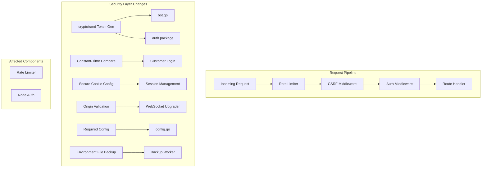
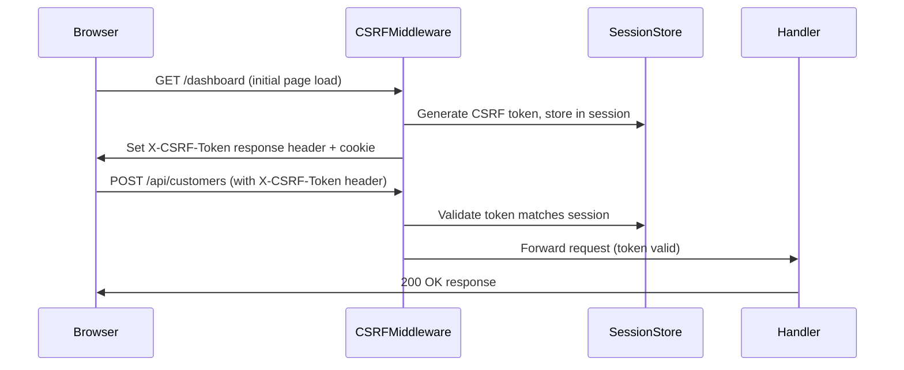
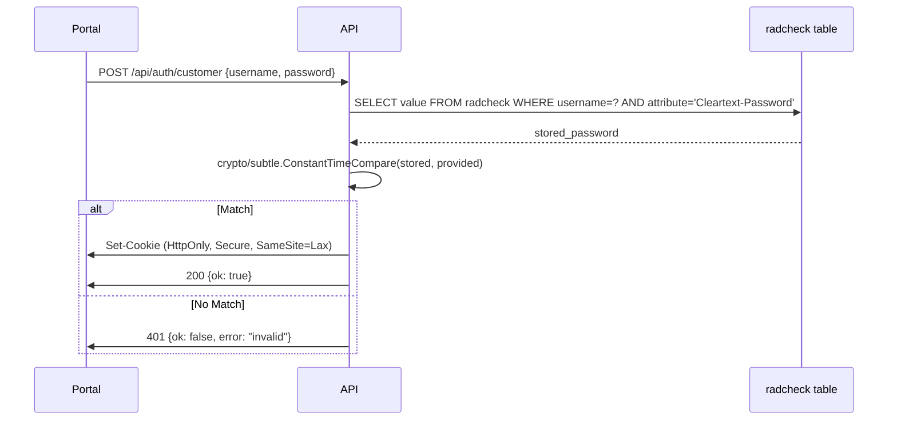

# Design Document: Security Hardening

## Overview

KorisPanel contains ten critical and high-severity security vulnerabilities spanning token generation, authentication, session management, input validation, and operational security. This design addresses all identified issues through a systematic remediation approach that preserves backward compatibility with the existing FreeRADIUS integration while hardening the panel's attack surface.

The fixes range from single-function replacements (cryptographic randomness, constant-time comparison) to new middleware layers (CSRF protection, origin-validated WebSocket upgrades) and configuration enforcement (mandatory secrets, secure cookie flags). Each fix is designed to be independently deployable and testable.

## Architecture



## Sequence Diagrams

### CSRF Token Flow



### Secure Customer Login Flow



## Components and Interfaces

### Component 1: Cryptographic Token Generator (bot.go fix)

**Purpose**: Replace predictable `randomHex()` with cryptographically secure random generation.

**Interface**:
```go
// randomHex generates n random bytes and returns their hex encoding.
// Uses crypto/rand for cryptographic security.
func randomHex(n int) string
```

**Responsibilities**:
- Generate unpredictable tokens for customer `sub_token` values
- Use `crypto/rand.Read` as entropy source
- Return hex-encoded string of specified byte length

### Component 2: Secure Config Loader (config.go fix)

**Purpose**: Refuse to start with insecure defaults in production.

**Interface**:
```go
type Config struct {
    Addr             string
    DBDSN            string
    SetupKey         string
    SessionSecret    string
    Version          string
    PublicBase       string
    AdminWebDir      string
    PortalWebDir     string
    SecureCookies    bool   // new: derived from environment
    TrustedProxies   []string // new: for rate limiter trust
}

func Load() Config  // panics if PANEL_SESSION_SECRET or PANEL_DB_DSN unset (unless PANEL_DEV_MODE=true)
```

**Responsibilities**:
- Require `PANEL_SESSION_SECRET` and `PANEL_DB_DSN` in production
- Allow `PANEL_DEV_MODE=true` to retain defaults for local development
- Log fatal and exit if mandatory vars are missing in production
- Expose `SecureCookies` flag (true unless `PANEL_DEV_MODE=true`)
- Parse `PANEL_TRUSTED_PROXIES` for rate limiter

### Component 3: CSRF Middleware

**Purpose**: Protect state-changing endpoints from cross-site request forgery.

**Interface**:
```go
package csrf

// Middleware returns an http.Handler that validates CSRF tokens
// on state-changing requests (POST, PUT, PATCH, DELETE).
// Safe methods (GET, HEAD, OPTIONS) pass through and receive a fresh token.
// Token is delivered via X-CSRF-Token response header and validated
// from X-CSRF-Token request header.
func Middleware(secret string, next http.Handler) http.Handler

// Token extracts the current CSRF token from request context.
func Token(r *http.Request) string
```

**Responsibilities**:
- Generate per-session CSRF tokens (HMAC-based, tied to session cookie)
- Validate token on POST/PUT/PATCH/DELETE requests
- Exempt `/api/node/*` endpoints (authenticated via X-Node-Token, not cookies)
- Exempt `/api/bot/webhook` endpoint (authenticated via Telegram secret)
- Return 403 with `{"ok":false,"error":"csrf_invalid"}` on failure
- Set `X-CSRF-Token` response header on all responses

### Component 4: Secure Session Cookie Configuration (auth.go fix)

**Purpose**: Add `Secure` flag and configurable attributes to session cookies.

**Interface**:
```go
// SetSession creates an authenticated session cookie with security flags.
func SetSession(w http.ResponseWriter, cookieName, username, secret string, secure bool)

// ClearSession removes the session cookie with matching security flags.
func ClearSession(w http.ResponseWriter, cookieName string, secure bool)
```

**Responsibilities**:
- Set `Secure: true` when `secure` parameter is true (production)
- Maintain `HttpOnly: true` and `SameSite: Lax` on all cookies
- Ensure `Path: "/"` for consistent cookie scope

### Component 5: Origin-Validated WebSocket Upgrader (api.go fix)

**Purpose**: Validate WebSocket connection origins to prevent cross-site hijacking.

**Interface**:
```go
// newUpgrader creates a WebSocket upgrader that validates Origin header
// against the configured public base URL.
func (s *Server) newUpgrader() websocket.Upgrader
```

**Responsibilities**:
- Parse request Origin header
- Compare against configured `PANEL_PUBLIC_BASE` / allowed origins
- Reject connections from unknown origins with appropriate error
- Allow same-origin and explicitly configured origins

### Component 6: Trusted Proxy Rate Limiter (ratelimit.go fix)

**Purpose**: Only trust `X-Real-IP` when request comes from a configured trusted proxy.

**Interface**:
```go
type Limiter struct {
    visitors       map[string]*visitor
    mu             sync.Mutex
    rate           float64
    burst          int
    trustedProxies map[string]bool // new: set of trusted proxy IPs/CIDRs
}

func New(rate float64, burst int, trustedProxies []string) *Limiter

func (l *Limiter) clientIP(r *http.Request) string // new: resolves IP with trust chain
```

**Responsibilities**:
- Accept `X-Real-IP` only if `r.RemoteAddr` is in trusted proxies list
- Fall back to `r.RemoteAddr` (stripped of port) when not from trusted proxy
- Support CIDR notation for proxy ranges (e.g., `10.0.0.0/8`)

### Component 7: Non-Destructive Node Auth (api.go fix)

**Purpose**: Fix `authNode()` to not consume the request body.

**Interface**:
```go
// authNode authenticates a node request.
// Token is read ONLY from X-Node-Token header. Body is never consumed.
func (s *Server) authNode(r *http.Request) (int64, bool)
```

**Responsibilities**:
- Read token exclusively from `X-Node-Token` header
- Never read or consume `r.Body`
- Return node ID and validity boolean

### Component 8: Secure Backup Worker (main.go fix)

**Purpose**: Prevent password exposure in process listings during database backup.

**Interface**:
```go
// runBackup executes mysqldump without exposing credentials in process list.
// Uses MYSQL_PWD environment variable instead of -p flag.
func runBackup(user, pass, dbname, outputFile string) error
```

**Responsibilities**:
- Pass password via `MYSQL_PWD` environment variable (not visible in `ps aux`)
- Alternatively, use a MySQL options file (`--defaults-extra-file`)
- Clean up temporary credentials after backup completes

## Data Models

### CSRF Token Structure

```go
// CSRFToken is an HMAC-SHA256 of the session identifier.
// Format: base64url(HMAC-SHA256(session_id, csrf_secret))
type csrfToken struct {
    SessionID string
    Timestamp int64
    Signature []byte
}
```

**Validation Rules**:
- Token must be valid base64url
- HMAC signature must match recomputed value
- Timestamp must be within token TTL (default: 24h, matching session TTL)

### Config Validation

```go
// Validation rules for production configuration:
// - PANEL_SESSION_SECRET: required, minimum 32 characters
// - PANEL_DB_DSN: required, non-empty
// - PANEL_TRUSTED_PROXIES: optional, comma-separated IP/CIDR list
// - PANEL_DEV_MODE: if "true", relaxes all above requirements
```

## Algorithmic Pseudocode

### CSRF Token Generation and Validation

```go
// GenerateCSRFToken creates a token bound to the user's session.
//
// ALGORITHM:
//   1. Extract session cookie value (the signed session string)
//   2. Compute HMAC-SHA256(session_value, csrf_secret)
//   3. Return base64url encoding of the HMAC
//
// PRECONDITIONS:
//   - secret is non-empty (enforced by config loader)
//   - session cookie exists (user is authenticated)
//
// POSTCONDITIONS:
//   - Returned token is deterministic for same session + secret
//   - Token changes when session rotates
func GenerateCSRFToken(sessionValue, secret string) string {
    mac := hmac.New(sha256.New, []byte(secret))
    mac.Write([]byte(sessionValue))
    return base64.RawURLEncoding.EncodeToString(mac.Sum(nil))
}

// ValidateCSRFToken checks the provided token against expected value.
//
// PRECONDITIONS:
//   - token is non-empty string
//   - request has valid session cookie
//
// POSTCONDITIONS:
//   - Returns true if and only if token matches expected HMAC
//   - Comparison is constant-time (no timing side channel)
func ValidateCSRFToken(token, sessionValue, secret string) bool {
    expected := GenerateCSRFToken(sessionValue, secret)
    return subtle.ConstantTimeCompare([]byte(token), []byte(expected)) == 1
}
```

### Secure randomHex Replacement

```go
// randomHex generates a cryptographically secure random hex string.
//
// ALGORITHM:
//   1. Allocate byte slice of length n
//   2. Fill with crypto/rand.Read
//   3. Hex-encode and return
//
// PRECONDITIONS:
//   - n > 0
//
// POSTCONDITIONS:
//   - Output length is 2*n characters
//   - Each call produces independent, unpredictable output
//   - Panics if crypto/rand fails (system entropy exhausted)
func randomHex(n int) string {
    b := make([]byte, n)
    if _, err := crypto_rand.Read(b); err != nil {
        panic("crypto/rand failed: " + err.Error())
    }
    return hex.EncodeToString(b)
}
```

### Constant-Time Password Comparison for Customer Login

```go
// customerLogin authenticates a customer against radcheck cleartext password.
//
// ALGORITHM:
//   1. Decode JSON body for username/password
//   2. Query radcheck for stored cleartext password
//   3. Use subtle.ConstantTimeCompare to compare
//   4. On success, create session; on failure, return 401
//
// PRECONDITIONS:
//   - Request method is POST
//   - Body contains valid JSON with username and password fields
//
// POSTCONDITIONS:
//   - Authentication result is independent of password length/content (no timing leak)
//   - Session cookie set only on successful auth
//   - Failed auth returns generic "invalid" error (no user enumeration)
func (s *Server) customerLogin(w http.ResponseWriter, r *http.Request) {
    // ... decode input ...
    var storedPw string
    err := s.DB.QueryRow(`SELECT value FROM radcheck WHERE username=? 
        AND attribute IN('Cleartext-Password','User-Password') 
        ORDER BY id DESC LIMIT 1`, in.Username).Scan(&storedPw)
    if err != nil {
        // Perform dummy comparison to prevent timing-based user enumeration
        subtle.ConstantTimeCompare([]byte("dummy"), []byte(in.Password))
        writeJSONCode(w, http.StatusUnauthorized, map[string]any{"ok": false, "error": "invalid"})
        return
    }
    if subtle.ConstantTimeCompare([]byte(storedPw), []byte(in.Password)) != 1 {
        writeJSONCode(w, http.StatusUnauthorized, map[string]any{"ok": false, "error": "invalid"})
        return
    }
    // ... set session ...
}
```

### Trusted Proxy IP Resolution

```go
// clientIP determines the real client IP respecting trusted proxy configuration.
//
// ALGORITHM:
//   1. Extract RemoteAddr, strip port
//   2. If RemoteAddr is in trustedProxies set:
//      a. Read X-Real-IP header
//      b. If present and valid IP, return it
//   3. Otherwise return RemoteAddr (ignore X-Real-IP)
//
// PRECONDITIONS:
//   - r.RemoteAddr is set by net/http (always true)
//   - trustedProxies is initialized (may be empty)
//
// POSTCONDITIONS:
//   - Returns a valid IP string (never empty)
//   - X-Real-IP only used when RemoteAddr is trusted
//   - Untrusted X-Real-IP headers are ignored
func (l *Limiter) clientIP(r *http.Request) string {
    remoteIP, _, _ := net.SplitHostPort(r.RemoteAddr)
    if remoteIP == "" {
        remoteIP = r.RemoteAddr
    }
    if !l.isTrustedProxy(remoteIP) {
        return remoteIP
    }
    if fwd := r.Header.Get("X-Real-IP"); fwd != "" {
        if ip := net.ParseIP(fwd); ip != nil {
            return fwd
        }
    }
    return remoteIP
}
```

### Secure Backup Without Process-Visible Password

```go
// runBackup performs mysqldump without exposing password in process list.
//
// ALGORITHM:
//   1. Create exec.Cmd for mysqldump with -u flag only (no -p flag)
//   2. Set cmd.Env with MYSQL_PWD=password
//   3. Pipe stdout to gzip writer to output file
//   4. Execute and return error status
//
// PRECONDITIONS:
//   - user, pass, dbname are non-empty
//   - output directory exists
//
// POSTCONDITIONS:
//   - Password never appears in /proc/*/cmdline
//   - Backup file is written on success
//   - MYSQL_PWD only exists in child process environment
func runBackup(user, pass, dbname, outputFile string) error {
    cmd := exec.Command("mysqldump", "-u", user, dbname)
    cmd.Env = append(os.Environ(), "MYSQL_PWD="+pass)
    out, err := os.Create(outputFile)
    if err != nil {
        return err
    }
    defer out.Close()
    cmd.Stdout = out
    return cmd.Run()
}
```

## Key Functions with Formal Specifications

### Function 1: `randomHex(n int) string`

```go
func randomHex(n int) string
```

**Preconditions:**
- `n > 0`

**Postconditions:**
- Returns string of length `2*n`
- Each byte drawn from `crypto/rand` (uniform distribution over [0,255])
- Consecutive calls produce independent outputs

**Loop Invariants:** N/A

### Function 2: `Middleware(secret string, next http.Handler) http.Handler`

```go
func Middleware(secret string, next http.Handler) http.Handler
```

**Preconditions:**
- `secret` is non-empty string (minimum 32 chars)
- `next` is a valid http.Handler

**Postconditions:**
- GET/HEAD/OPTIONS requests pass through unconditionally
- POST/PUT/PATCH/DELETE requests are rejected with 403 unless valid X-CSRF-Token header present
- Exempted paths (`/api/node/*`, `/api/bot/webhook`) bypass CSRF check
- X-CSRF-Token response header set on all responses

**Loop Invariants:** N/A

### Function 3: `clientIP(r *http.Request) string`

```go
func (l *Limiter) clientIP(r *http.Request) string
```

**Preconditions:**
- `r` is a valid HTTP request with `RemoteAddr` set
- `l.trustedProxies` is initialized

**Postconditions:**
- Returns non-empty IP string
- If `RemoteAddr` not in trusted proxies, `X-Real-IP` is ignored
- If `RemoteAddr` in trusted proxies and `X-Real-IP` is valid IP, returns `X-Real-IP`
- Never returns empty string

**Loop Invariants:** N/A

### Function 4: `authNode(r *http.Request) (int64, bool)`

```go
func (s *Server) authNode(r *http.Request) (int64, bool)
```

**Preconditions:**
- `r` is a valid HTTP request
- `r.Body` has not been read

**Postconditions:**
- `r.Body` is NOT consumed (remains readable for downstream handlers)
- Returns `(nodeID, true)` if valid token in X-Node-Token header
- Returns `(0, false)` if token missing or invalid

**Loop Invariants:** N/A

### Function 5: `SetSession(w, cookieName, username, secret string, secure bool)`

```go
func SetSession(w http.ResponseWriter, cookieName, username, secret string, secure bool)
```

**Preconditions:**
- `w` is a valid ResponseWriter (headers not yet sent)
- `username` is non-empty
- `secret` is non-empty

**Postconditions:**
- Cookie set with `HttpOnly: true`
- Cookie set with `SameSite: Lax`
- Cookie set with `Secure: secure` parameter value
- Cookie `Path` is `"/"`
- Cookie expires in 24 hours

**Loop Invariants:** N/A

## Example Usage

```go
// Example 1: Secure token generation in bot
func (b *Bot) cmdCreate(chatID int64, username, password string) {
    subToken := randomHex(24) // 48-char hex, crypto/rand backed
    _, err := tx.Exec(`INSERT INTO customers(username, sub_token, created_by) VALUES(?, ?, 'telegram_bot')`, 
        username, subToken)
    // ...
}

// Example 2: CSRF middleware integration in main.go
func main() {
    // ...
    mux := srv.Routes().(*http.ServeMux)
    csrfProtected := csrf.Middleware(cfg.SessionSecret, mux)
    limiter := ratelimit.New(10, 30, cfg.TrustedProxies)
    log.Fatal(http.ListenAndServe(cfg.Addr, limiter.Middleware(csrfProtected)))
}

// Example 3: Config enforcement
// When PANEL_DEV_MODE is not "true":
//   $ ./panel
//   FATAL: PANEL_SESSION_SECRET is required in production. Set PANEL_DEV_MODE=true for development.

// Example 4: Customer login with constant-time compare
if subtle.ConstantTimeCompare([]byte(storedPw), []byte(in.Password)) != 1 {
    writeJSONCode(w, http.StatusUnauthorized, map[string]any{"ok": false, "error": "invalid"})
    return
}

// Example 5: Backup without password in process list
cmd := exec.Command("mysqldump", "-u", user, dbname)
cmd.Env = append(os.Environ(), "MYSQL_PWD="+pass)
```

## Correctness Properties

1. **Token Unpredictability**: For all tokens generated by `randomHex(n)`, no polynomial-time adversary can predict the next token given all previously generated tokens.

2. **Timing Independence**: For all pairs `(pw1, pw2)` where `len(pw1) == len(pw2)`, the execution time of `subtle.ConstantTimeCompare([]byte(stored), []byte(pw1))` equals the execution time of `subtle.ConstantTimeCompare([]byte(stored), []byte(pw2))`.

3. **CSRF Completeness**: For all state-changing requests `r` where `r.Method in {POST, PUT, PATCH, DELETE}` and `r.Path` not in exempted paths, if `X-CSRF-Token` header is missing or invalid, then the response status is 403.

4. **Cookie Security**: For all session cookies set when `secure=true`, the cookie has `Secure=true`, `HttpOnly=true`, and `SameSite=Lax`.

5. **Body Preservation**: For all requests `r` passed through `authNode(r)`, `r.Body` remains unread and available to subsequent handlers.

6. **Proxy Trust Chain**: For all requests where `RemoteAddr` is not in `trustedProxies`, the `X-Real-IP` header value is never used as the client identifier.

7. **Config Enforcement**: For all invocations where `PANEL_DEV_MODE != "true"`, if `PANEL_SESSION_SECRET == ""` or `PANEL_DB_DSN == ""`, the process exits with a fatal error before accepting connections.

8. **Origin Validation**: For all WebSocket upgrade requests where `Origin` header does not match allowed origins, the upgrade is rejected with an appropriate HTTP error.

9. **Credential Opacity**: For all backup executions, the database password never appears as a command-line argument visible in `/proc/*/cmdline`.

10. **Session Secret Strength**: For all production deployments, `SessionSecret` has minimum entropy of 256 bits (32+ random characters).

## Error Handling

### Error Scenario 1: Missing Mandatory Configuration

**Condition**: `PANEL_SESSION_SECRET` or `PANEL_DB_DSN` not set and `PANEL_DEV_MODE != "true"`
**Response**: `log.Fatalf` with clear message indicating which variable is missing
**Recovery**: Operator must set the environment variable and restart

### Error Scenario 2: CSRF Token Validation Failure

**Condition**: State-changing request arrives without valid CSRF token
**Response**: HTTP 403 with `{"ok":false,"error":"csrf_invalid"}`
**Recovery**: Client-side SPA must read `X-CSRF-Token` from response headers and include in subsequent requests

### Error Scenario 3: WebSocket Origin Rejected

**Condition**: WebSocket upgrade request with non-matching Origin header
**Response**: HTTP 403, connection not upgraded
**Recovery**: Client must connect from an allowed origin

### Error Scenario 4: crypto/rand Failure

**Condition**: System entropy pool exhausted (extremely rare)
**Response**: `randomHex` panics, crashing the goroutine
**Recovery**: Process restart; investigate system entropy source

### Error Scenario 5: Rate Limit with Spoofed IP

**Condition**: Untrusted client sends `X-Real-IP` header to bypass rate limit
**Response**: Header ignored; rate limiting applied to actual `RemoteAddr`
**Recovery**: No recovery needed - attack is silently defeated

## Testing Strategy

### Unit Testing Approach

- **randomHex**: Verify output length, uniqueness across 1000 calls, hex-only characters
- **CSRF Middleware**: Test token generation, validation, exemption paths, rejection of missing/invalid tokens
- **clientIP**: Test with trusted/untrusted proxies, various header combinations
- **customerLogin**: Verify constant-time behavior (within statistical bounds), correct accept/reject
- **authNode**: Verify body is not consumed (read body after authNode returns)
- **Config.Load**: Test with/without env vars, dev mode vs production mode
- **SetSession/ClearSession**: Verify cookie attributes under secure/insecure modes

### Property-Based Testing Approach

**Property Test Library**: `testing/quick` (Go stdlib) or `github.com/leanovate/gopter`

- **Property**: For all random byte lengths n in [1, 1024], `randomHex(n)` returns string of length `2*n` containing only `[0-9a-f]`
- **Property**: For all pairs of passwords (a, b) where `a != b`, `customerLogin` rejects with identical timing (within margin)
- **Property**: For all HTTP methods in {POST, PUT, PATCH, DELETE} and non-exempt paths, requests without X-CSRF-Token are rejected
- **Property**: For all RemoteAddr values not in trustedProxies, returned clientIP equals RemoteAddr regardless of X-Real-IP value

### Integration Testing Approach

- End-to-end CSRF flow: Login → get token → make POST with token → verify success
- End-to-end CSRF rejection: Login → make POST without token → verify 403
- WebSocket origin validation: Connect from allowed origin (success) vs. disallowed origin (failure)
- Config enforcement: Start process without required vars → verify immediate exit
- Backup security: Run backup → inspect `/proc/{pid}/cmdline` → verify no password visible

## Performance Considerations

- **CSRF overhead**: Single HMAC-SHA256 computation per request (~1 microsecond) - negligible
- **crypto/rand in randomHex**: ~10x slower than `math/rand` but still under 1ms for typical token sizes (24-32 bytes)
- **Constant-time compare**: Same performance as regular compare for equal-length strings; negligible overhead
- **Rate limiter proxy check**: Single map lookup per request - O(1)
- **WebSocket origin check**: String comparison on Origin header - negligible

## Security Considerations

- **Defense in depth**: Multiple layers (CSRF + SameSite cookie + origin validation) protect against cross-origin attacks
- **Timing attacks**: All secret comparisons use constant-time functions
- **Entropy**: All security tokens derived from `crypto/rand` (backed by OS entropy: `/dev/urandom` on Linux)
- **Backward compatibility**: FreeRADIUS still reads cleartext passwords from `radcheck`; portal login adds timing protection without changing stored format
- **Dev mode escape hatch**: `PANEL_DEV_MODE=true` allows local development without mandatory secrets, but logs prominent warnings
- **CSRF exemptions**: Node API endpoints use bearer token auth (not cookies) so CSRF is not applicable
- **WebSocket**: After origin validation, existing session auth still required via cookie

## Dependencies

- `crypto/rand` (Go stdlib) - secure random generation
- `crypto/subtle` (Go stdlib) - constant-time comparison
- `crypto/hmac`, `crypto/sha256` (Go stdlib) - CSRF token generation
- `net` (Go stdlib) - IP parsing for trusted proxy validation
- `github.com/gorilla/websocket` (existing dependency) - WebSocket with custom CheckOrigin
- No new external dependencies required
