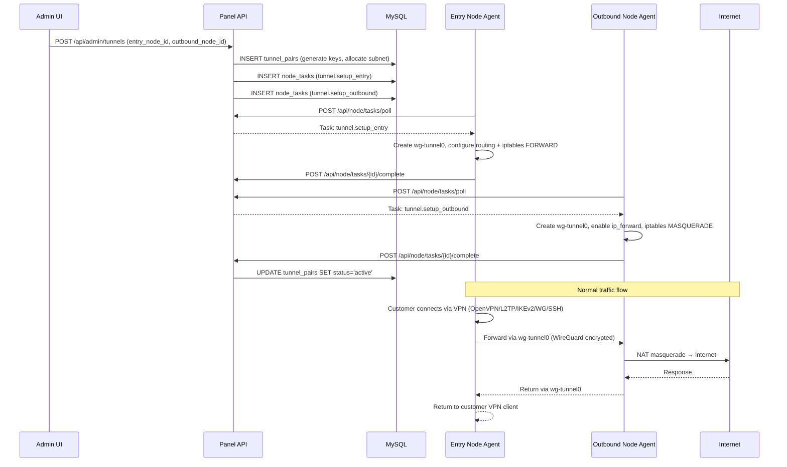
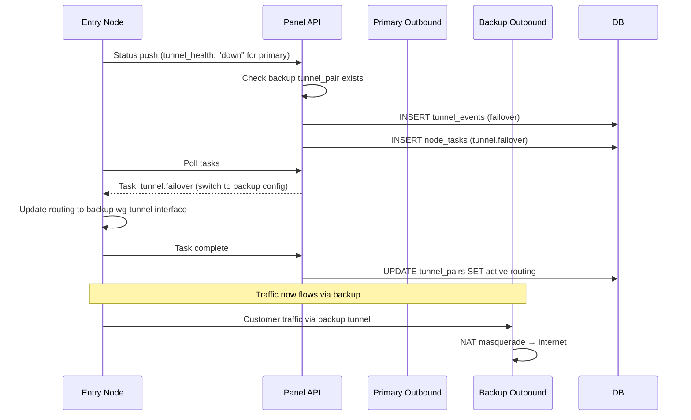
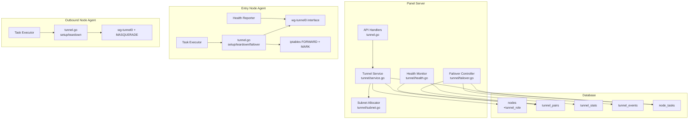

# Design Document: Tunnel Mode (Iran Traffic)

## Overview

This design implements the Tunnel Mode feature for KorisPanel, enabling a two-hop VPN architecture where customers connect to Iran-based entry nodes, which forward traffic through encrypted WireGuard tunnels to foreign outbound nodes. The outbound nodes perform NAT/masquerade and route traffic to the internet, bypassing DPI-based blocking of direct VPN connections.

### Key Design Decisions

1. **WireGuard kernel-mode for inter-node tunnel**: Using WireGuard (not userspace) for the tunnel between entry and outbound nodes provides minimal CPU/memory overhead suitable for 1GB RAM VPS, while ensuring encryption against DPI.
2. **Separate tunnel interface (wg-tunnelN)**: The inter-node tunnel uses a dedicated WireGuard interface (wg-tunnel0, wg-tunnel1, etc.) separate from any customer-facing wg0 interface, preventing configuration conflicts.
3. **Policy-based routing on entry node**: Customer VPN traffic is routed through the tunnel using iptables MARK + ip rule + ip route, not by changing default routes. This ensures only VPN-originated traffic goes through the tunnel while node management traffic (SSH, agent heartbeat) uses the default gateway.
4. **Automatic subnet allocation from 10.200.0.0/16**: Each tunnel pair gets a /30 subnet from the 10.200.0.0/16 range, providing point-to-point addressing without wasting IPs.
5. **Panel-orchestrated failover**: Failover decisions are made by the panel (not by entry nodes autonomously) based on health reports, ensuring centralized control and audit logging. The entry node executes failover commands dispatched by the panel.
6. **Extend existing outbound.go pattern**: The node agent already has outbound proxy logic in `node/cmd/node/outbound.go`. Tunnel mode extends this with native WireGuard tunnel commands rather than the SOCKS5 bridge approach used for protocol-level outbound.

## Architecture



### Failover Flow



### Component Interaction



## Components and Interfaces

### 1. Panel API Endpoints

#### Admin Endpoints (require admin auth)

| Method | Path | Description |
|--------|------|-------------|
| GET | `/api/admin/tunnels` | List all tunnel pairs with status and health |
| POST | `/api/admin/tunnels` | Create a new tunnel pair |
| DELETE | `/api/admin/tunnels/{id}` | Remove a tunnel pair |
| GET | `/api/admin/tunnels/{id}` | Get tunnel pair details with traffic stats |
| POST | `/api/admin/tunnels/{id}/failover` | Manually trigger failover |
| GET | `/api/admin/tunnels/events` | List failover/failback events |
| PUT | `/api/admin/nodes/{id}/tunnel-role` | Set node tunnel role |
| GET | `/api/admin/nodes/entry` | List nodes with role=entry |
| GET | `/api/admin/nodes/outbound` | List nodes with role=outbound |

#### Node Agent Endpoints (existing, extended)

| Method | Path | Description |
|--------|------|-------------|
| POST | `/api/node/push` | Status push (extended with tunnel_health, tunnel_stats) |
| POST | `/api/node/tasks/poll` | Poll pending tasks (existing, handles new tunnel.* actions) |
| POST | `/api/node/tasks/{id}/complete` | Report task completion (existing) |

### 2. Node Agent Task Handlers

| Task Action | Target | Payload | Behavior |
|-------------|--------|---------|----------|
| `tunnel.setup_entry` | Entry_Node | `{outbound_ip, tunnel_subnet, entry_private_key, outbound_public_key, tunnel_port, mtu, interface_name}` | Create WireGuard tunnel interface, add peer (outbound), configure policy routing for VPN traffic, apply tc qdisc |
| `tunnel.setup_outbound` | Outbound_Node | `{entry_ip, tunnel_subnet, outbound_private_key, entry_public_key, tunnel_port, mtu, interface_name}` | Create WireGuard tunnel interface, add peer (entry with allowed-ips 0.0.0.0/0), enable ip_forward, apply MASQUERADE |
| `tunnel.teardown` | Both | `{interface_name}` | Remove WireGuard interface, remove routing rules, remove iptables rules |
| `tunnel.failover` | Entry_Node | `{old_interface, new_interface, new_outbound_ip, new_private_key, new_outbound_public_key, new_tunnel_subnet, tunnel_port, mtu}` | Create new tunnel interface, switch routing from old to new, remove old interface |
| `tunnel.failback` | Entry_Node | `{backup_interface, primary_interface, primary_outbound_ip, primary_private_key, primary_outbound_public_key, primary_tunnel_subnet, tunnel_port, mtu}` | Switch routing back to primary tunnel, remove backup interface if not needed |
| `tunnel.health_check` | Entry_Node | `{}` | Return current WireGuard handshake status for all tunnel interfaces |

### 3. Tunnel Subnet Allocator

New file: `panel/internal/tunnel/subnet.go`

```go
package tunnel

// AllocateNextSubnet finds the next available /30 subnet from the 10.200.0.0/16
// range that is not already assigned to an active tunnel pair.
func AllocateNextSubnet(usedSubnets []string) (subnet string, entryIP string, outboundIP string, err error)

// ParseTunnelSubnet extracts the entry and outbound IPs from a /30 tunnel subnet.
// Entry always gets .1, outbound gets .2.
func ParseTunnelSubnet(subnet string) (entryIP string, outboundIP string, err error)
```

Allocation scheme:
- Base range: `10.200.0.0/16` (65,536 addresses = 16,384 /30 subnets)
- Each tunnel pair gets a `/30` (4 IPs: network, entry .1, outbound .2, broadcast)
- Entry node IP: `x.x.x.1/30`
- Outbound node IP: `x.x.x.2/30`
- Sequential allocation: `10.200.0.0/30`, `10.200.0.4/30`, `10.200.0.8/30`, ...

### 4. Entry Node Setup Script (executed by Node_Agent)

```bash
# tunnel.setup_entry task execution
INTERFACE="wg-tunnel0"
ENTRY_IP="10.200.0.1/30"
OUTBOUND_IP="10.200.0.2"
OUTBOUND_PUBLIC_IP="203.0.113.1"
PRIVATE_KEY="<entry_private_key>"
OUTBOUND_PUBKEY="<outbound_public_key>"
TUNNEL_PORT=51821
MTU=1400

# Create WireGuard config
cat > /etc/wireguard/${INTERFACE}.conf << EOF
[Interface]
PrivateKey = ${PRIVATE_KEY}
Address = ${ENTRY_IP}
ListenPort = ${TUNNEL_PORT}
MTU = ${MTU}

[Peer]
PublicKey = ${OUTBOUND_PUBKEY}
Endpoint = ${OUTBOUND_PUBLIC_IP}:${TUNNEL_PORT}
AllowedIPs = 0.0.0.0/0
PersistentKeepalive = 15
EOF

# Bring up interface
wg-quick up ${INTERFACE}

# Policy routing: mark VPN traffic and route through tunnel
iptables -t mangle -A PREROUTING -i tun+ -j MARK --set-mark 0x100
iptables -t mangle -A PREROUTING -i ppp+ -j MARK --set-mark 0x100
iptables -t mangle -A PREROUTING -i wg0 -j MARK --set-mark 0x100
ip rule add fwmark 0x100 table 100 priority 100
ip route add default via ${OUTBOUND_IP} dev ${INTERFACE} table 100

# Allow forwarding
iptables -A FORWARD -i tun+ -o ${INTERFACE} -j ACCEPT
iptables -A FORWARD -i ppp+ -o ${INTERFACE} -j ACCEPT
iptables -A FORWARD -i wg0 -o ${INTERFACE} -j ACCEPT
iptables -A FORWARD -i ${INTERFACE} -o tun+ -m state --state RELATED,ESTABLISHED -j ACCEPT
iptables -A FORWARD -i ${INTERFACE} -o ppp+ -m state --state RELATED,ESTABLISHED -j ACCEPT
iptables -A FORWARD -i ${INTERFACE} -o wg0 -m state --state RELATED,ESTABLISHED -j ACCEPT

# Traffic control for low latency
tc qdisc add dev ${INTERFACE} root fq_codel
# DSCP EF marking
iptables -t mangle -A POSTROUTING -o ${INTERFACE} -j DSCP --set-dscp-class EF
```

### 5. Outbound Node Setup Script (executed by Node_Agent)

```bash
# tunnel.setup_outbound task execution
INTERFACE="wg-tunnel0"
OUTBOUND_IP="10.200.0.2/30"
ENTRY_PUBLIC_IP="91.108.x.x"
PRIVATE_KEY="<outbound_private_key>"
ENTRY_PUBKEY="<entry_public_key>"
TUNNEL_PORT=51821
MTU=1400
WAN_INTERFACE="eth0"  # detected from default route

# Create WireGuard config
cat > /etc/wireguard/${INTERFACE}.conf << EOF
[Interface]
PrivateKey = ${PRIVATE_KEY}
Address = ${OUTBOUND_IP}
ListenPort = ${TUNNEL_PORT}
MTU = ${MTU}

[Peer]
PublicKey = ${ENTRY_PUBKEY}
Endpoint = ${ENTRY_PUBLIC_IP}:${TUNNEL_PORT}
AllowedIPs = 0.0.0.0/0
PersistentKeepalive = 15
EOF

# Bring up interface
wg-quick up ${INTERFACE}

# Enable IP forwarding
sysctl -w net.ipv4.ip_forward=1
echo "net.ipv4.ip_forward=1" >> /etc/sysctl.d/99-tunnel.conf

# NAT masquerade for tunneled traffic
iptables -t nat -A POSTROUTING -s 10.200.0.0/16 -o ${WAN_INTERFACE} -j MASQUERADE
iptables -A FORWARD -i ${INTERFACE} -o ${WAN_INTERFACE} -j ACCEPT
iptables -A FORWARD -i ${WAN_INTERFACE} -o ${INTERFACE} -m state --state RELATED,ESTABLISHED -j ACCEPT
```

### 6. Health Check Implementation (Entry Node)

The entry node agent checks tunnel health during each status push cycle:

```go
// In node agent status push, for each tunnel interface:
// 1. Run: wg show wg-tunnel0 latest-handshakes
// 2. Parse timestamp, calculate age
// 3. Report status:
//    - healthy: handshake < 30s ago
//    - degraded: handshake 30-90s ago
//    - down: handshake > 90s ago OR interface not present
```

### 7. Frontend Components

#### Admin UI (`panel/web/admin/`)

- `src/views/tunnels/TunnelListView.vue` — Main tunnel management page with pair list, health indicators, traffic stats summary
- `src/views/tunnels/TunnelDetailView.vue` — Detailed view for a single tunnel pair (traffic charts, config details)
- `src/views/tunnels/TunnelCreateDialog.vue` — Dialog for creating new tunnel pairs (select entry + outbound nodes)
- `src/views/tunnels/TunnelEventsView.vue` — Failover event history list
- `src/components/TunnelRoleSelector.vue` — Reusable node role selector component (used in node edit)
- `src/composables/useTunnels.ts` — API composable for tunnel endpoints

## Data Models

### Database Schema (migration: 0XX_tunnel_mode.sql)

```sql
-- Add tunnel_role to nodes table
ALTER TABLE nodes ADD COLUMN tunnel_role ENUM('none','entry','outbound') NOT NULL DEFAULT 'none';

-- Tunnel pairs table
CREATE TABLE tunnel_pairs (
    id BIGINT AUTO_INCREMENT PRIMARY KEY,
    entry_node_id BIGINT NOT NULL,
    outbound_node_id BIGINT NOT NULL,
    tunnel_subnet VARCHAR(18) NOT NULL,          -- e.g. "10.200.0.0/30"
    entry_wg_public_key VARCHAR(44) NOT NULL,
    entry_wg_private_key_encrypted TEXT NOT NULL,
    outbound_wg_public_key VARCHAR(44) NOT NULL,
    outbound_wg_private_key_encrypted TEXT NOT NULL,
    tunnel_port INT NOT NULL DEFAULT 51821,
    mtu INT NOT NULL DEFAULT 1400,
    interface_name VARCHAR(20) NOT NULL DEFAULT 'wg-tunnel0',
    status ENUM('pending','active','error','removed') NOT NULL DEFAULT 'pending',
    priority INT NOT NULL DEFAULT 1,
    health_status ENUM('unknown','healthy','degraded','down') NOT NULL DEFAULT 'unknown',
    last_health_check_at DATETIME NULL,
    error_message TEXT NULL,
    created_at TIMESTAMP DEFAULT CURRENT_TIMESTAMP,
    updated_at TIMESTAMP DEFAULT CURRENT_TIMESTAMP ON UPDATE CURRENT_TIMESTAMP,
    INDEX idx_entry_status (entry_node_id, status),
    INDEX idx_outbound_status (outbound_node_id, status),
    INDEX idx_status (status),
    UNIQUE KEY uniq_subnet (tunnel_subnet)
);

-- Tunnel traffic statistics (hourly granularity)
CREATE TABLE tunnel_stats (
    id BIGINT AUTO_INCREMENT PRIMARY KEY,
    tunnel_pair_id BIGINT NOT NULL,
    entry_tx_bytes BIGINT NOT NULL DEFAULT 0,
    entry_rx_bytes BIGINT NOT NULL DEFAULT 0,
    outbound_tx_bytes BIGINT NOT NULL DEFAULT 0,
    outbound_rx_bytes BIGINT NOT NULL DEFAULT 0,
    recorded_at DATETIME NOT NULL,
    INDEX idx_pair_time (tunnel_pair_id, recorded_at),
    INDEX idx_recorded_at (recorded_at)
);

-- Tunnel events (failover/failback audit log)
CREATE TABLE tunnel_events (
    id BIGINT AUTO_INCREMENT PRIMARY KEY,
    tunnel_pair_id BIGINT NOT NULL,
    event_type ENUM('failover','failback','error','recovery','created','removed') NOT NULL,
    from_outbound_id BIGINT NULL,
    to_outbound_id BIGINT NULL,
    reason TEXT NULL,
    created_at TIMESTAMP DEFAULT CURRENT_TIMESTAMP,
    INDEX idx_pair_events (tunnel_pair_id, created_at),
    INDEX idx_type (event_type)
);
```

### Node Agent Status Push Extension

```json
{
  "tunnel_health": [
    {
      "interface": "wg-tunnel0",
      "tunnel_pair_id": 1,
      "status": "healthy",
      "last_handshake_age_sec": 12,
      "tx_bytes": 1234567890,
      "rx_bytes": 9876543210
    }
  ],
  "tunnel_active_count": 1
}
```

### Tunnel Pair API Response

```json
{
  "id": 1,
  "entry_node_id": 5,
  "entry_node_name": "ir-tehran-01",
  "entry_node_ip": "91.108.x.x",
  "outbound_node_id": 8,
  "outbound_node_name": "de-frankfurt-01",
  "outbound_node_ip": "203.0.113.1",
  "tunnel_subnet": "10.200.0.0/30",
  "entry_wg_public_key": "base64...",
  "outbound_wg_public_key": "base64...",
  "tunnel_port": 51821,
  "mtu": 1400,
  "status": "active",
  "priority": 1,
  "health_status": "healthy",
  "last_health_check_at": "2024-01-15T10:30:00Z",
  "created_at": "2024-01-10T08:00:00Z"
}
```

## Correctness Properties

### Property 1: Tunnel subnet allocation uniqueness

*For any* set of already-allocated subnets from the 10.200.0.0/16 range, AllocateNextSubnet SHALL return a /30 subnet that does not overlap with any existing allocated subnet.

**Validates: Requirements 2.3, 11.2**

### Property 2: Tunnel subnet parsing produces valid entry/outbound IPs

*For any* valid /30 subnet from the 10.200.0.0/16 range, ParseTunnelSubnet SHALL return an entryIP ending in .1 and an outboundIP ending in .2, both within the subnet's address range.

**Validates: Requirements 2.3, 3.1, 3.2**

### Property 3: Node role validation prevents dual-role assignment

*For any* node, setting tunnel_role to "entry" SHALL be rejected if the node currently has active tunnel pairs as an outbound node, and vice versa. Setting to "none" SHALL be rejected if any active tunnel pairs reference the node.

**Validates: Requirements 1.4, 1.5**

### Property 4: Tunnel health classification from handshake age

*For any* non-negative handshake age in seconds, the health classification SHALL be: "healthy" if age < 30, "degraded" if 30 ≤ age < 90, "down" if age ≥ 90.

**Validates: Requirements 5.1, 5.2, 5.3**

### Property 5: Failover selects next priority backup

*For any* entry node with N tunnel pairs of different priorities, when the active pair (lowest priority number) fails, the failover controller SHALL select the pair with the next lowest priority number that has health_status != "down".

**Validates: Requirements 6.1, 6.2**

### Property 6: Tunnel pair removal is idempotent

*For any* tunnel pair that is already in "removed" status, attempting to remove it again SHALL not create duplicate teardown tasks or duplicate tunnel events.

**Validates: Requirements 8.1, 8.4**

### Property 7: Entry node routing rules are protocol-agnostic

*For any* set of VPN interfaces (tun+, ppp+, wg0), the generated iptables marking rules SHALL mark traffic from ALL listed interfaces with the same fwmark, ensuring all protocols route through the tunnel without protocol-specific logic.

**Validates: Requirements 4.1, 4.3**

### Property 8: Traffic statistics aggregation preserves totals

*For any* sequence of hourly traffic stat records for a tunnel pair, summing entry_tx_bytes across all records SHALL equal the total cumulative entry TX bytes reported. The sum must be monotonically non-decreasing over time.

**Validates: Requirements 7.1, 7.3**

### Property 9: WireGuard key generation produces valid keys for tunnel

*For any* invocation of tunnel key pair generation, both the entry and outbound keys SHALL be valid 44-character base64 strings decoding to exactly 32 bytes, and entry_public_key ≠ outbound_public_key.

**Validates: Requirements 2.2**

### Property 10: Maximum tunnel pairs per entry node enforcement

*For any* entry node with N active tunnel pairs (where N equals the configured maximum), attempting to create an additional pair SHALL be rejected with an error.

**Validates: Requirements 2.6**

## Error Handling

| Scenario | Response | Recovery |
|----------|----------|----------|
| Node role change with active tunnels | 400 `{"error": "active_tunnels_exist", "message": "Remove active tunnel pairs before changing role"}` | Admin removes tunnels first |
| Entry node at max tunnel pairs | 400 `{"error": "max_tunnel_pairs_reached"}` | Admin removes old pairs or increases limit |
| Subnet pool exhausted | 500 `{"error": "subnet_pool_exhausted"}` | Admin removes old tunnel pairs to free subnets |
| Tunnel setup task failure (entry) | Task status "failed", tunnel_pair status "error" | Admin reviews error, re-dispatches or fixes node |
| Tunnel setup task failure (outbound) | Task status "failed", tunnel_pair status "error" | Admin reviews error, re-dispatches or fixes node |
| Both nodes fail setup | tunnel_pair stays "pending" until manual retry | Admin investigates node connectivity |
| WireGuard not installed on node | Task "failed" with "wg: command not found" | Admin installs wireguard-tools on node |
| Failover with no backup configured | Alert notification sent to admin | Admin adds backup tunnel pair |
| Outbound node unreachable | Health reports "down", failover triggered | Automatic if backup exists, alert if not |
| Invalid tunnel port | 400 `{"error": "invalid_tunnel_port"}` | Admin provides port in 1024-65535 range |
| Entry and outbound are same node | 400 `{"error": "same_node"}` | Admin selects different nodes |

## Testing Strategy

### Property-Based Tests

Property-based testing is appropriate for this feature because it contains pure functions with clear input/output behavior (subnet allocation, health classification, key generation, routing rule generation, failover priority selection).

**Library:** `pgregory.net/rapid` for Go backend, `fast-check` for TypeScript frontend

**Configuration:** Minimum 100 iterations per property test.

| Property | Test Location | What Varies |
|----------|---------------|-------------|
| P1: Subnet allocation uniqueness | `panel/internal/tunnel/subnet_test.go` | Random sets of already-used subnets |
| P2: Subnet parsing validity | `panel/internal/tunnel/subnet_test.go` | All possible /30 subnets in 10.200.0.0/16 |
| P3: Role validation | `panel/internal/tunnel/service_test.go` | Random node states with active pairs |
| P4: Health classification | `node/cmd/node/tunnel_test.go` | Random handshake ages (0 to 600 seconds) |
| P5: Failover priority selection | `panel/internal/tunnel/failover_test.go` | Random priority sets with various health states |
| P6: Removal idempotency | `panel/internal/tunnel/service_test.go` | Random tunnel pair states |
| P7: Routing rules protocol coverage | `node/cmd/node/tunnel_test.go` | Random interface name sets |
| P8: Traffic stats aggregation | `panel/internal/tunnel/stats_test.go` | Random sequences of traffic byte values |
| P9: Key generation validity | `panel/internal/tunnel/keygen_test.go` | Multiple generation runs |
| P10: Max pairs enforcement | `panel/internal/tunnel/service_test.go` | Random entry nodes with varying pair counts |

### Unit Tests (example-based)

- Tunnel setup script generation for entry node
- Tunnel setup script generation for outbound node
- Failover task payload construction
- Teardown cleanup (iptables rules, WireGuard interface)
- API response formatting for tunnel pair list
- Node role change validation scenarios
- Traffic stats hourly aggregation

### Integration Tests

- Full tunnel pair lifecycle: create → setup → active → teardown → removed
- Failover flow: health down → panel detects → dispatches failover → entry switches
- Node status push with tunnel_health data ingestion
- Concurrent tunnel pair creation (subnet collision prevention)

### Smoke Tests

- Migration applies cleanly (tunnel_role column, tunnel_pairs/stats/events tables)
- Tunnel pair create/list/delete API endpoints respond correctly
- Node role assignment API works
- Entry and outbound nodes can be listed by role

