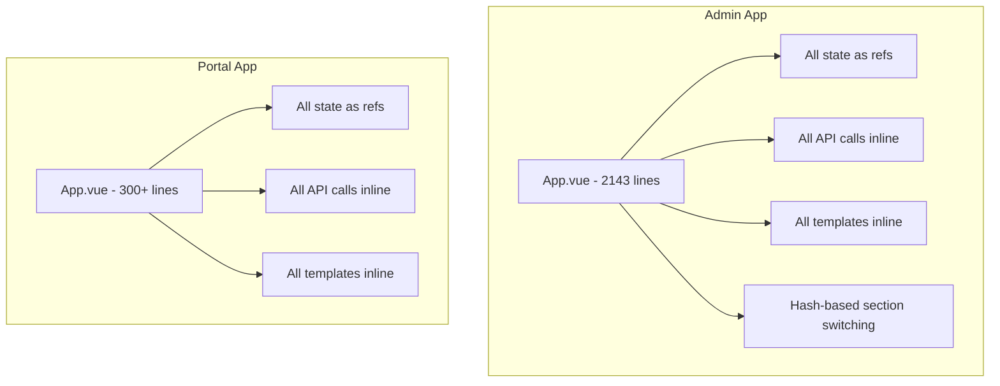
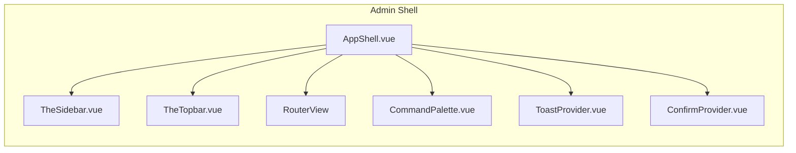
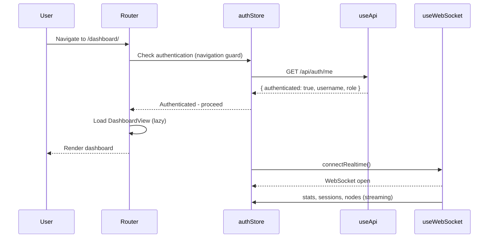
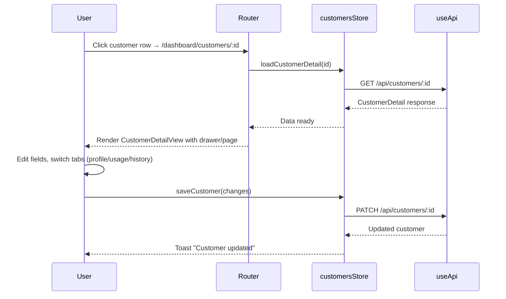
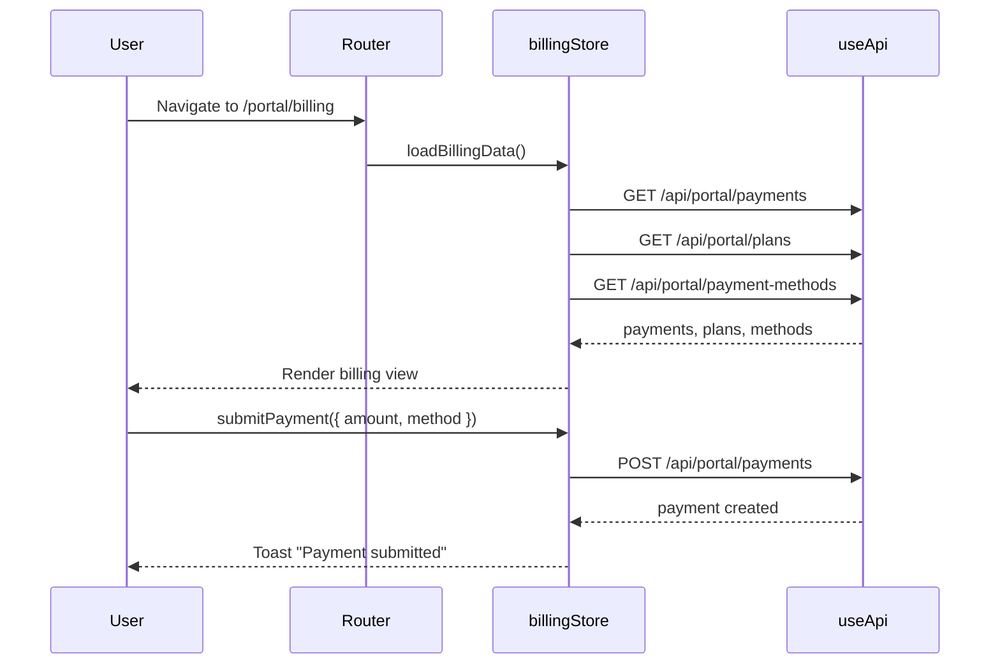

# Design Document: KorisPanel UI Enhancement

## Overview

KorisPanel is a VPN management platform consisting of two Vue 3 + TypeScript frontend applications: an Admin Panel for full system management and a Customer Portal for end-user self-service. Both applications currently suffer from a monolithic single-file architecture (2143+ lines in admin `App.vue`, 300+ in portal `App.vue`) with no router, no state management, no component decomposition, and limited accessibility.

This design refactors the architecture into a modular, maintainable codebase with Vue Router for navigation, Pinia for state management, and a shared component library. It introduces proper component decomposition, composable-based logic extraction, enhanced data visualization, accessibility compliance (WCAG 2.1 AA), and performance optimizations including route-level code splitting, virtual scrolling for large datasets, and skeleton loading per-component.

The existing design system tokens (`#070a12` background, `#2563eb` primary, `#22d3ee` accent) and dark command-center aesthetic are preserved throughout all changes.

## Architecture

### Current Architecture (Monolithic)



### Target Architecture (Modular)

```mermaid
graph TD
    subgraph "Shared Package @koris/ui"
        UI[Component Library]
        UI --> BTN[KButton / KIconButton]
        UI --> TBL[KTable / KDataTable]
        UI --> FRM[KInput / KSelect / KTextarea]
        UI --> MOD[KModal / KDrawer / KConfirmDialog]
        UI --> FDB[KToast / KAlert / KSkeleton]
        UI --> CHT[KChart / KSparkline / KDonut]
        UI --> NAV[KBreadcrumb / KTabs / KPagination]
        UI --> ACC[KStatusPill / KAvatar / KEmptyState]
    end

    subgraph "Admin App"
        AR[Vue Router] --> VIEWS
        VIEWS --> OV[DashboardView]
        VIEWS --> CV[CustomersView]
        VIEWS --> CD[CustomerDetailView]
        VIEWS --> PV[PlansView]
        VIEWS --> PAY[PaymentsView]
        VIEWS --> TK[TicketsView]
        VIEWS --> RS[ResellersView]
        VIEWS --> ND[NodesView]
        VIEWS --> SY[SettingsView]
        
        PS[Pinia Stores] --> AS[authStore]
        PS --> CS[customersStore]
        PS --> NS[nodesStore]
        PS --> TS[ticketsStore]
        PS --> PPS[paymentsStore]
        PS --> PLS[plansStore]
        PS --> RSS[realtimeStore]
        
        COMP[Composables] --> UseAPI[useApi]
        COMP --> UseWS[useWebSocket]
        COMP --> UseTheme[useTheme]
        COMP --> UseI18n[useI18n]
        COMP --> UseCmd[useCommandPalette]
        COMP --> UseNotif[useNotifications]
    end

    subgraph "Portal App"
        PR[Vue Router] --> PVIEWS
        PVIEWS --> PL[LoginView]
        PVIEWS --> PD[PortalDashboardView]
        PVIEWS --> PB[BillingView]
        PVIEWS --> PT[SupportView]
        PVIEWS --> PP[ProfileView]
        PVIEWS --> PU[UsageView]
        
        PPS2[Pinia Stores] --> PAS[portalAuthStore]
        PPS2 --> PBS[billingStore]
        PPS2 --> PTS[portalTicketsStore]
        PPS2 --> PUS[usageStore]
    end

    VIEWS --> UI
    PVIEWS --> UI
```



### Application Shell Architecture



## Sequence Diagrams

### Admin App Boot Sequence



### Customer Detail Navigation



### Portal Billing Flow



## Components and Interfaces

### Shared Component Library (`@koris/ui`)

#### KButton

**Purpose**: Unified button component with variants matching the design system.

```typescript
interface KButtonProps {
  variant: 'primary' | 'ghost' | 'danger' | 'text'
  size: 'sm' | 'md' | 'lg'
  loading?: boolean
  disabled?: boolean
  icon?: string
  iconPosition?: 'left' | 'right'
  fullWidth?: boolean
}

interface KButtonEmits {
  (e: 'click', event: MouseEvent): void
}
```

**Responsibilities**:
- Render gradient primary, bordered ghost, or destructive danger buttons
- Show spinner overlay when `loading` is true
- Manage disabled and focus-visible states
- Emit click only when not disabled/loading

#### KDataTable

**Purpose**: Feature-rich data table with sorting, filtering, pagination, and row selection.

```typescript
interface KDataTableColumn<T = any> {
  key: string
  label: string
  sortable?: boolean
  filterable?: boolean
  width?: string
  align?: 'left' | 'center' | 'right'
  render?: (value: any, row: T) => VNode
  filterType?: 'text' | 'select' | 'date-range'
  filterOptions?: { label: string; value: string }[]
}

interface KDataTableProps<T = any> {
  columns: KDataTableColumn<T>[]
  data: T[]
  loading?: boolean
  selectable?: boolean
  stickyHeader?: boolean
  emptyText?: string
  emptyIcon?: string
  rowKey?: string | ((row: T) => string | number)
  virtualScroll?: boolean
  rowHeight?: number
  pageSize?: number
  currentPage?: number
  totalItems?: number
  serverSide?: boolean
}

interface KDataTableEmits<T = any> {
  (e: 'sort', payload: { key: string; direction: 'asc' | 'desc' }): void
  (e: 'filter', payload: Record<string, any>): void
  (e: 'page-change', page: number): void
  (e: 'row-click', row: T): void
  (e: 'selection-change', selected: T[]): void
  (e: 'export', format: 'csv' | 'json'): void
}
```

**Responsibilities**:
- Render sortable column headers with directional indicators
- Provide per-column text/select/date-range filters
- Handle client-side or server-side pagination
- Support virtual scrolling for 1000+ rows via `virtualScroll` prop
- Emit export events for CSV/JSON generation
- Show skeleton rows when `loading` is true
- Keyboard-navigable rows with proper ARIA attributes

#### KDrawer

**Purpose**: Slide-in panel for complex detail views (replaces modal for customer detail).

```typescript
interface KDrawerProps {
  open: boolean
  side?: 'right' | 'left'
  width?: string
  title?: string
  closable?: boolean
  overlay?: boolean
}

interface KDrawerEmits {
  (e: 'close'): void
  (e: 'after-enter'): void
  (e: 'after-leave'): void
}
```

**Responsibilities**:
- Slide in from specified side with CSS transition
- Trap focus within drawer when open
- Close on Escape key or overlay click
- Manage body scroll lock
- Announce to screen readers via `role="dialog"` and `aria-modal`

#### KConfirmDialog

**Purpose**: Replace native `confirm()` with branded, accessible confirmation dialog.

```typescript
interface ConfirmOptions {
  title: string
  message: string
  confirmText?: string
  cancelText?: string
  variant?: 'danger' | 'warning' | 'info'
  icon?: string
}

interface UseConfirmReturn {
  confirm(options: ConfirmOptions): Promise<boolean>
  isOpen: Ref<boolean>
}
```

**Responsibilities**:
- Show modal with title, message, and action buttons
- Return a Promise resolving to true/false
- Auto-focus the cancel button for destructive actions
- Keyboard accessible (Enter to confirm, Escape to cancel)

#### KChart (Interactive)

**Purpose**: Interactive charts replacing static SVG polylines.

```typescript
interface KChartProps {
  type: 'line' | 'area' | 'bar' | 'donut'
  data: ChartDataPoint[]
  options?: ChartOptions
  animate?: boolean
  interactive?: boolean
  height?: number
}

interface ChartDataPoint {
  label: string
  value: number
  color?: string
}

interface ChartOptions {
  showTooltip?: boolean
  showGrid?: boolean
  showLegend?: boolean
  yAxisFormat?: (value: number) => string
  xAxisFormat?: (label: string) => string
  gradientFill?: boolean
  smoothCurve?: boolean
}

interface KChartEmits {
  (e: 'point-hover', payload: { point: ChartDataPoint; index: number }): void
  (e: 'point-click', payload: { point: ChartDataPoint; index: number }): void
}
```

**Responsibilities**:
- Render SVG-based charts with smooth animations
- Show interactive tooltips on hover
- Support responsive sizing
- Respect `prefers-reduced-motion`
- Gradient fills for area charts matching brand colors

#### KFormField (with Validation)

**Purpose**: Form field wrapper with integrated validation feedback.

```typescript
interface ValidationRule {
  type: 'required' | 'minLength' | 'maxLength' | 'pattern' | 'custom'
  value?: any
  message: string
  validator?: (value: any) => boolean
}

interface KFormFieldProps {
  label: string
  name: string
  rules?: ValidationRule[]
  error?: string
  hint?: string
  required?: boolean
}
```

**Responsibilities**:
- Display label with required indicator
- Show validation error or hint text below field
- Connect label to input via `for`/`id` attributes
- Announce errors to screen readers via `aria-describedby`

### Admin Layout Components

#### TheSidebar

```typescript
interface NavItem {
  key: Section
  label: string
  icon: string
  badge?: number | string
  children?: NavItem[]
}

interface TheSidebarProps {
  collapsed?: boolean
  currentSection: Section
  navItems: NavItem[]
  user: { username: string; role: string; initials: string }
}

interface TheSidebarEmits {
  (e: 'navigate', section: Section): void
  (e: 'collapse-toggle'): void
  (e: 'logout'): void
}
```

#### TheTopbar

```typescript
interface TheTopbarProps {
  title: string
  subtitle?: string
  breadcrumbs?: Breadcrumb[]
  realtimeConnected: boolean
  notificationCount: number
}

interface Breadcrumb {
  label: string
  to?: string
}

interface TheTopbarEmits {
  (e: 'open-command-palette'): void
  (e: 'open-notifications'): void
  (e: 'toggle-theme'): void
}
```

## Data Models

### Router Configuration (Admin)

```typescript
import type { RouteRecordRaw } from 'vue-router'

const routes: RouteRecordRaw[] = [
  {
    path: '/dashboard',
    component: () => import('@/layouts/AppShell.vue'),
    meta: { requiresAuth: true },
    children: [
      { path: '', name: 'overview', component: () => import('@/views/DashboardView.vue') },
      { path: 'customers', name: 'customers', component: () => import('@/views/CustomersView.vue') },
      { path: 'customers/:id', name: 'customer-detail', component: () => import('@/views/CustomerDetailView.vue') },
      { path: 'plans', name: 'plans', component: () => import('@/views/PlansView.vue') },
      { path: 'payments', name: 'payments', component: () => import('@/views/PaymentsView.vue') },
      { path: 'tickets', name: 'tickets', component: () => import('@/views/TicketsView.vue') },
      { path: 'tickets/:id', name: 'ticket-detail', component: () => import('@/views/TicketDetailView.vue') },
      { path: 'resellers', name: 'resellers', component: () => import('@/views/ResellersView.vue') },
      { path: 'nodes', name: 'nodes', component: () => import('@/views/NodesView.vue') },
      { path: 'settings', name: 'settings', component: () => import('@/views/SettingsView.vue') },
      { path: 'settings/:tab', name: 'settings-tab', component: () => import('@/views/SettingsView.vue') },
    ]
  },
  { path: '/dashboard/login', name: 'login', component: () => import('@/views/LoginView.vue') },
  { path: '/dashboard/setup', name: 'setup', component: () => import('@/views/SetupView.vue') },
  { path: '/:pathMatch(.*)*', redirect: '/dashboard' }
]
```

### Pinia Store Interfaces

```typescript
// stores/auth.ts
interface AuthState {
  user: { username: string; role: string; credit: number } | null
  isAuthenticated: boolean
  setupRequired: boolean
  setupKeyRequired: boolean
}

// stores/customers.ts
interface CustomersState {
  list: Customer[]
  deleted: DeletedCustomer[]
  detail: CustomerDetail | null
  usage: UsageSummary | null
  loading: boolean
  detailLoading: boolean
  filters: {
    search: string
    status: 'active' | 'archived' | 'online' | 'limited' | 'disabled' | 'expired'
    sortBy: string
    sortDir: 'asc' | 'desc'
  }
  pagination: {
    page: number
    pageSize: number
    total: number
  }
}

// stores/realtime.ts
interface RealtimeState {
  connected: boolean
  stats: Stats
  liveSessions: UsageSession[]
  rxHistory: number[]
  txHistory: number[]
  notifications: Notification[]
}

// stores/nodes.ts
interface NodesState {
  list: NodeItem[]
  tasks: NodeTask[]
  vpnSettings: VPNSettings | null
  vpnConfigs: Record<number, any[]>
  loading: boolean
}
```

### Shared Type Definitions (`@koris/types`)

```typescript
// types/api.ts
interface ApiResponse<T = unknown> {
  ok: boolean
  error?: string
  data?: T
}

interface PaginatedResponse<T> extends ApiResponse {
  items: T[]
  total: number
  page: number
  pageSize: number
}

// types/entities.ts - consolidate from both apps
interface Customer {
  id: number
  username: string
  display_name: string
  status: 'active' | 'disabled' | 'expired' | 'limited'
  plan_id?: number | null
  plan: string
  credit: number
  created_at: string
}

interface CustomerDetail extends Customer {
  notes: string
  sub_token: string
  radius_checks: RadiusCheck[]
  radius_replies: RadiusCheck[]
  subscription?: Subscription
  subscriptions: SubscriptionHistory[]
  wallet_transactions: WalletTransaction[]
}

interface Plan {
  id: number
  name: string
  data_gb: number
  speed_mbps: number
  duration_days: number
  price: number
  is_active: boolean
  sort_order: number
  created_at: string
}

interface NodeItem {
  id: number
  name: string
  public_ip: string
  domain: string
  status: 'online' | 'offline'
  last_seen_at: string
  created_at: string
  status_metrics: NodeMetrics
  services: NodeService[]
  history?: BandwidthSnapshot[]
}

interface NodeMetrics {
  cpu_percent: number
  ram_percent: number
  disk_percent: number
  rx_bps: number
  tx_bps: number
  openvpn_status: string
  l2tp_status: string
  ikev2_status: string
  updated_at: string
}

interface Ticket {
  id: number
  customer_id?: number
  username: string
  subject: string
  status: 'open' | 'closed' | 'pending'
  priority: 'low' | 'normal' | 'high' | 'urgent'
  created_at: string
  updated_at: string
  closed_at: string
}

interface Payment {
  id: number
  username: string
  amount: number
  method: string
  status: 'pending' | 'approved' | 'rejected'
  intent_type: string
  intent_id?: number
  intent_label: string
  created_at: string
  updated_at: string
}
```

## Algorithmic Pseudocode

### Virtual Scroll Algorithm

```typescript
/**
 * Virtual scroll engine for KDataTable
 * Only renders visible rows + buffer, enabling smooth scrolling for 10k+ items
 */

interface VirtualScrollState {
  scrollTop: number
  containerHeight: number
  rowHeight: number
  totalItems: number
  bufferSize: number
}

interface VirtualScrollResult {
  startIndex: number
  endIndex: number
  offsetY: number
  totalHeight: number
  visibleItems: number
}

function calculateVisibleRange(state: VirtualScrollState): VirtualScrollResult {
  // PRECONDITION: state.rowHeight > 0, state.totalItems >= 0
  // POSTCONDITION: startIndex <= endIndex, all visible rows are included with buffer

  const totalHeight = state.totalItems * state.rowHeight
  const visibleItems = Math.ceil(state.containerHeight / state.rowHeight)

  const rawStart = Math.floor(state.scrollTop / state.rowHeight)
  const startIndex = Math.max(0, rawStart - state.bufferSize)
  const endIndex = Math.min(
    state.totalItems - 1,
    rawStart + visibleItems + state.bufferSize
  )

  const offsetY = startIndex * state.rowHeight

  return { startIndex, endIndex, offsetY, totalHeight, visibleItems }
}
```

**Preconditions:**
- `state.rowHeight` is a positive number (minimum 20px)
- `state.totalItems` is non-negative
- `state.containerHeight` is positive (container is mounted and visible)

**Postconditions:**
- `startIndex >= 0` and `endIndex < totalItems`
- All rows within the visible viewport are included in the range
- Buffer rows above/below provide smooth scroll experience
- `offsetY` correctly positions the visible slice via CSS transform

**Loop Invariants:** N/A (single-pass calculation)

### Navigation Guard Algorithm

```typescript
/**
 * Router navigation guard handling authentication and role-based access
 */

interface NavigationContext {
  to: { path: string; meta: { requiresAuth?: boolean; roles?: string[] } }
  authState: { isAuthenticated: boolean; user: { role: string } | null }
  setupRequired: boolean
}

type NavigationResult =
  | { action: 'allow' }
  | { action: 'redirect'; path: string }

function resolveNavigation(ctx: NavigationContext): NavigationResult {
  // PRECONDITION: ctx.to is a valid route, ctx.authState is current
  // POSTCONDITION: Returns allow or redirect, never throws

  // Step 1: Check if system needs setup
  if (ctx.setupRequired && ctx.to.path !== '/dashboard/setup') {
    return { action: 'redirect', path: '/dashboard/setup' }
  }

  // Step 2: If route doesn't require auth, allow
  if (!ctx.to.meta.requiresAuth) {
    return { action: 'allow' }
  }

  // Step 3: If not authenticated, redirect to login
  if (!ctx.authState.isAuthenticated) {
    return { action: 'redirect', path: '/dashboard/login' }
  }

  // Step 4: Check role-based access
  if (ctx.to.meta.roles && ctx.authState.user) {
    if (!ctx.to.meta.roles.includes(ctx.authState.user.role)) {
      return { action: 'redirect', path: '/dashboard' }
    }
  }

  return { action: 'allow' }
}
```

**Preconditions:**
- `ctx.to` represents a resolved route object with valid meta fields
- `ctx.authState` reflects the latest authentication check

**Postconditions:**
- Always returns a valid `NavigationResult`
- Unauthenticated users never reach protected routes
- Setup flow takes priority over all other navigation

### WebSocket Reconnection Algorithm

```typescript
/**
 * Exponential backoff reconnection for realtime WebSocket
 */

interface ReconnectState {
  attempt: number
  maxAttempts: number
  baseDelay: number  // ms
  maxDelay: number   // ms
  connected: boolean
}

function calculateReconnectDelay(state: ReconnectState): number | null {
  // PRECONDITION: state.attempt >= 0, state.baseDelay > 0
  // POSTCONDITION: Returns delay in ms, or null if max attempts exceeded

  if (state.attempt >= state.maxAttempts) {
    return null // give up
  }

  // Exponential backoff with jitter
  const exponentialDelay = state.baseDelay * Math.pow(2, state.attempt)
  const jitter = Math.random() * state.baseDelay
  const delay = Math.min(exponentialDelay + jitter, state.maxDelay)

  return delay
}

// Usage in composable:
// Initial: { attempt: 0, maxAttempts: 10, baseDelay: 1000, maxDelay: 30000 }
// Delays: ~1s, ~2s, ~4s, ~8s, ~16s, ~30s (capped), ...
```

**Preconditions:**
- `state.baseDelay > 0` (typically 1000ms)
- `state.maxDelay >= state.baseDelay`
- `state.attempt` increments on each failure

**Postconditions:**
- Returns `null` when `maxAttempts` exceeded (signals permanent failure to UI)
- Delay never exceeds `maxDelay`
- Jitter prevents thundering herd on server recovery

### Form Validation Engine

```typescript
/**
 * Composable-based form validation with rule evaluation
 */

interface FieldState {
  value: any
  dirty: boolean
  touched: boolean
  rules: ValidationRule[]
  errors: string[]
}

interface FormState {
  fields: Record<string, FieldState>
  isValid: boolean
  isDirty: boolean
}

function validateField(field: FieldState): string[] {
  // PRECONDITION: field.rules is an array of ValidationRule
  // POSTCONDITION: Returns array of error messages (empty = valid)

  const errors: string[] = []

  for (const rule of field.rules) {
    let valid = true

    switch (rule.type) {
      case 'required':
        valid = field.value !== '' && field.value !== null && field.value !== undefined
        break
      case 'minLength':
        valid = typeof field.value === 'string' && field.value.length >= rule.value
        break
      case 'maxLength':
        valid = typeof field.value === 'string' && field.value.length <= rule.value
        break
      case 'pattern':
        valid = new RegExp(rule.value).test(String(field.value))
        break
      case 'custom':
        valid = rule.validator ? rule.validator(field.value) : true
        break
    }

    if (!valid) {
      errors.push(rule.message)
    }
  }

  return errors
}

function validateForm(state: FormState): boolean {
  // PRECONDITION: all fields registered in state.fields
  // POSTCONDITION: state.isValid reflects overall validity

  let allValid = true

  for (const key of Object.keys(state.fields)) {
    const field = state.fields[key]
    field.errors = validateField(field)
    if (field.errors.length > 0) allValid = false
  }

  state.isValid = allValid
  return allValid
}
```

**Preconditions:**
- Field rules are properly configured before validation
- Field values are set (may be empty/null which triggers 'required' rule)

**Postconditions:**
- Each field's `errors` array is updated with current validation state
- `formState.isValid` is `true` only if ALL fields pass ALL rules
- Validation is synchronous and deterministic for same inputs

**Loop Invariants:**
- For rule iteration: all previously checked rules maintain their error/success state
- For field iteration: previously validated fields retain their error arrays

## Key Functions with Formal Specifications

### useApi Composable

```typescript
interface UseApiOptions {
  baseUrl?: string
  onUnauthorized?: () => void
  onError?: (error: ApiError) => void
}

interface UseApiReturn {
  get<T>(url: string, options?: RequestInit): Promise<T>
  post<T>(url: string, body?: unknown, options?: RequestInit): Promise<T>
  put<T>(url: string, body?: unknown, options?: RequestInit): Promise<T>
  patch<T>(url: string, body?: unknown, options?: RequestInit): Promise<T>
  del<T>(url: string, options?: RequestInit): Promise<T>
  loading: Ref<boolean>
  error: Ref<string>
}

function useApi(options?: UseApiOptions): UseApiReturn
```

**Preconditions:**
- Browser `fetch` API is available
- Cookies/credentials are configured for same-origin requests

**Postconditions:**
- All methods set `loading.value = true` before request, `false` after
- On HTTP 401, calls `onUnauthorized` callback (typically redirects to login)
- On error, sets `error.value` with user-friendly message
- Automatically sets `Content-Type: application/json` for POST/PUT/PATCH
- Returns parsed JSON response body typed as `T`

### useWebSocket Composable

```typescript
interface UseWebSocketOptions {
  url: string
  autoConnect?: boolean
  reconnect?: boolean
  maxReconnectAttempts?: number
  onMessage?: (data: any) => void
  onConnect?: () => void
  onDisconnect?: () => void
}

interface UseWebSocketReturn {
  connected: Ref<boolean>
  connect(): void
  disconnect(): void
  send(data: any): void
}

function useWebSocket(options: UseWebSocketOptions): UseWebSocketReturn
```

**Preconditions:**
- `options.url` is a valid WebSocket URL (ws:// or wss://)
- Component is mounted (composable used within setup)

**Postconditions:**
- `connected` ref accurately reflects WebSocket state
- `disconnect()` cleanly closes socket and cancels reconnection timers
- Auto-reconnects with exponential backoff when `reconnect: true`
- Cleans up on component unmount (no memory leaks)

### useFormValidation Composable

```typescript
interface UseFormValidationOptions<T extends Record<string, any>> {
  initialValues: T
  rules: Partial<Record<keyof T, ValidationRule[]>>
  validateOnChange?: boolean
}

interface UseFormValidationReturn<T extends Record<string, any>> {
  values: Ref<T>
  errors: Ref<Partial<Record<keyof T, string[]>>>
  touched: Ref<Partial<Record<keyof T, boolean>>>
  isValid: ComputedRef<boolean>
  isDirty: ComputedRef<boolean>
  validate(): boolean
  validateField(field: keyof T): boolean
  reset(): void
  setFieldValue(field: keyof T, value: any): void
  setFieldTouched(field: keyof T): void
}

function useFormValidation<T extends Record<string, any>>(
  options: UseFormValidationOptions<T>
): UseFormValidationReturn<T>
```

**Preconditions:**
- `initialValues` provides defaults for all form fields
- Rules reference valid field names from `initialValues`

**Postconditions:**
- `isValid` is reactive and updates on value changes (if `validateOnChange: true`)
- `reset()` restores all values to initial state and clears all errors
- `validate()` runs all rules and returns boolean for form submission gating
- Individual field validation via `validateField()` for blur-based validation

### useCommandPalette Composable

```typescript
interface CommandAction {
  id: string
  label: string
  description?: string
  icon?: string
  shortcut?: string
  action: () => void
  section?: string
  keywords?: string[]
}

interface UseCommandPaletteOptions {
  actions: ComputedRef<CommandAction[]> | Ref<CommandAction[]>
  shortcut?: string  // default: 'ctrl+k'
}

interface UseCommandPaletteReturn {
  isOpen: Ref<boolean>
  query: Ref<string>
  filteredActions: ComputedRef<CommandAction[]>
  selectedIndex: Ref<number>
  open(): void
  close(): void
  execute(action: CommandAction): void
}

function useCommandPalette(options: UseCommandPaletteOptions): UseCommandPaletteReturn
```

**Preconditions:**
- Actions array contains unique `id` values
- Component is mounted (keyboard listeners need DOM)

**Postconditions:**
- `Ctrl+K` (or custom shortcut) toggles the palette open/closed
- `filteredActions` contains fuzzy-matched results against label, description, and keywords
- Arrow keys navigate `selectedIndex`, Enter executes selected action
- Escape closes the palette and resets query

## Example Usage

### Setting Up the Admin Router

```typescript
// src/router/index.ts
import { createRouter, createWebHistory } from 'vue-router'
import { useAuthStore } from '@/stores/auth'

const router = createRouter({
  history: createWebHistory('/dashboard/'),
  routes: [
    {
      path: '/',
      component: () => import('@/layouts/AppShell.vue'),
      meta: { requiresAuth: true },
      children: [
        { path: '', name: 'overview', component: () => import('@/views/DashboardView.vue') },
        { path: 'customers', name: 'customers', component: () => import('@/views/CustomersView.vue') },
        { path: 'customers/:id', name: 'customer-detail', component: () => import('@/views/CustomerDetailView.vue'), props: true },
        { path: 'plans', name: 'plans', component: () => import('@/views/PlansView.vue') },
        { path: 'payments', name: 'payments', component: () => import('@/views/PaymentsView.vue') },
        { path: 'tickets', name: 'tickets', component: () => import('@/views/TicketsView.vue') },
        { path: 'tickets/:id', name: 'ticket-detail', component: () => import('@/views/TicketDetailView.vue'), props: true },
        { path: 'resellers', name: 'resellers', component: () => import('@/views/ResellersView.vue') },
        { path: 'nodes', name: 'nodes', component: () => import('@/views/NodesView.vue') },
        { path: 'settings/:tab?', name: 'settings', component: () => import('@/views/SettingsView.vue'), props: true },
      ]
    },
    { path: '/login', name: 'login', component: () => import('@/views/LoginView.vue') },
    { path: '/setup', name: 'setup', component: () => import('@/views/SetupView.vue') },
  ]
})

router.beforeEach(async (to) => {
  const auth = useAuthStore()

  if (!auth.initialized) {
    await auth.checkAuth()
  }

  if (auth.setupRequired && to.name !== 'setup') {
    return { name: 'setup' }
  }

  if (to.meta.requiresAuth && !auth.isAuthenticated) {
    return { name: 'login', query: { redirect: to.fullPath } }
  }

  if ((to.name === 'login' || to.name === 'setup') && auth.isAuthenticated) {
    return { name: 'overview' }
  }
})

export default router
```

### Using KDataTable in CustomersView

```typescript
// views/CustomersView.vue
<script setup lang="ts">
import { computed } from 'vue'
import { useRouter } from 'vue-router'
import { useCustomersStore } from '@/stores/customers'
import { useConfirm } from '@/composables/useConfirm'
import KDataTable from '@koris/ui/KDataTable.vue'
import KButton from '@koris/ui/KButton.vue'
import KBreadcrumb from '@koris/ui/KBreadcrumb.vue'

const router = useRouter()
const store = useCustomersStore()
const { confirm } = useConfirm()

const columns = computed(() => [
  { key: 'username', label: 'Username', sortable: true, filterable: true },
  { key: 'display_name', label: 'Name', sortable: true },
  { key: 'status', label: 'Status', sortable: true, filterable: true, filterType: 'select' as const,
    filterOptions: [
      { label: 'Active', value: 'active' },
      { label: 'Disabled', value: 'disabled' },
      { label: 'Expired', value: 'expired' },
      { label: 'Limited', value: 'limited' },
    ]
  },
  { key: 'plan', label: 'Plan', sortable: true },
  { key: 'credit', label: 'Credit', sortable: true, align: 'right' as const },
  { key: 'created_at', label: 'Joined', sortable: true },
])

async function handleDelete(customer: Customer) {
  const confirmed = await confirm({
    title: 'Delete Customer',
    message: `Are you sure you want to delete "${customer.username}"? This cannot be undone.`,
    variant: 'danger',
    confirmText: 'Delete',
  })
  if (confirmed) {
    await store.deleteCustomer(customer.id)
  }
}
</script>
```

### Using useApi in a Pinia Store

```typescript
// stores/customers.ts
import { defineStore } from 'pinia'
import { useApi } from '@/composables/useApi'
import type { Customer, CustomerDetail, PaginatedResponse } from '@koris/types'

export const useCustomersStore = defineStore('customers', () => {
  const api = useApi({ onUnauthorized: () => router.push('/login') })

  const list = ref<Customer[]>([])
  const detail = ref<CustomerDetail | null>(null)
  const loading = ref(false)
  const detailLoading = ref(false)
  const filters = reactive({
    search: '',
    status: 'active' as const,
    sortBy: 'created_at',
    sortDir: 'desc' as const,
    page: 1,
    pageSize: 25,
  })

  const filteredList = computed(() => {
    let items = [...list.value]

    if (filters.search) {
      const q = filters.search.toLowerCase()
      items = items.filter(c =>
        c.username.toLowerCase().includes(q) ||
        c.display_name.toLowerCase().includes(q)
      )
    }

    if (filters.status !== 'active') {
      items = items.filter(c => c.status === filters.status)
    }

    // Sort
    items.sort((a, b) => {
      const aVal = a[filters.sortBy as keyof Customer] ?? ''
      const bVal = b[filters.sortBy as keyof Customer] ?? ''
      const cmp = String(aVal).localeCompare(String(bVal))
      return filters.sortDir === 'asc' ? cmp : -cmp
    })

    return items
  })

  async function loadCustomers() {
    loading.value = true
    try {
      const res = await api.get<{ ok: boolean; customers: Customer[] }>('/api/customers')
      list.value = res.customers || []
    } finally {
      loading.value = false
    }
  }

  async function loadDetail(id: number) {
    detailLoading.value = true
    try {
      detail.value = await api.get<CustomerDetail>(`/api/customers/${id}`)
    } finally {
      detailLoading.value = false
    }
  }

  async function deleteCustomer(id: number) {
    await api.del(`/api/customers/${id}`)
    list.value = list.value.filter(c => c.id !== id)
  }

  return { list, detail, loading, detailLoading, filters, filteredList, loadCustomers, loadDetail, deleteCustomer }
})
```

### Transition Between Views

```typescript
// layouts/AppShell.vue - route transition
<template>
  <div class="app-shell" :class="{ 'sidebar-collapsed': sidebarCollapsed }">
    <TheSidebar
      :collapsed="sidebarCollapsed"
      :current-section="currentSection"
      :nav-items="navItems"
      :user="authStore.user"
      @navigate="handleNavigate"
      @collapse-toggle="sidebarCollapsed = !sidebarCollapsed"
      @logout="authStore.logout()"
    />
    <main class="main" role="main" :aria-label="currentPageTitle">
      <TheTopbar
        :title="currentPageTitle"
        :breadcrumbs="breadcrumbs"
        :realtime-connected="realtimeStore.connected"
        :notification-count="realtimeStore.notificationCount"
        @open-command-palette="commandPalette.open()"
        @open-notifications="notificationsOpen = true"
        @toggle-theme="themeStore.toggle()"
      />
      <router-view v-slot="{ Component, route }">
        <Transition :name="transitionName" mode="out-in">
          <Suspense>
            <component :is="Component" :key="route.path" />
            <template #fallback>
              <KPageSkeleton />
            </template>
          </Suspense>
        </Transition>
      </router-view>
    </main>
    <CommandPalette />
    <ToastProvider />
    <ConfirmProvider />
  </div>
</template>
```

## Correctness Properties

*A property is a characteristic or behavior that should hold true across all valid executions of a system—essentially, a formal statement about what the system should do. Properties serve as the bridge between human-readable specifications and machine-verifiable correctness guarantees.*

### Property 1: Navigation Guard Correctness

*For any* route object and authentication state, the `resolveNavigation` function SHALL: (a) redirect to `/setup` if `setupRequired` is true and target is not setup; (b) redirect to `/login` if route requires auth and user is unauthenticated; (c) redirect to `/dashboard` if route requires a role the user lacks; (d) allow navigation otherwise. These rules apply in priority order.

**Validates: Requirements 2.1, 2.2, 2.5**

### Property 2: Catch-All Route Redirect

*For any* URL path that does not match a defined route in the router configuration, the router SHALL redirect to the application's root path (`/dashboard` for Admin_Panel, `/portal` for Customer_Portal).

**Validates: Requirements 1.6, 1.7**

### Property 3: API Loading State Bracketing

*For any* API call made through the useApi composable (regardless of success or failure), `loading.value` SHALL transition from `false` to `true` before the request and back to `false` after the response is processed.

**Validates: Requirements 3.3, 11.2**

### Property 4: API Error Handling

*For any* HTTP response with a non-2xx status code, the useApi composable SHALL set `error.value` to a non-empty human-readable string. For status 401 specifically, it SHALL additionally invoke the `onUnauthorized` callback exactly once.

**Validates: Requirements 11.3, 11.4**

### Property 5: API Content-Type Header

*For any* POST, PUT, or PATCH request made through the useApi composable, the request SHALL include a `Content-Type: application/json` header.

**Validates: Requirement 11.5**

### Property 6: Store Data Preservation on Error

*For any* Pinia store with existing data, when an API action encounters an error, the store's existing data collections SHALL remain unchanged (no data loss or corruption).

**Validates: Requirement 3.4**

### Property 7: Button Click Prevention

*For any* KButton instance where either `loading` or `disabled` prop is `true`, clicking the button zero or more times SHALL result in zero `click` events being emitted.

**Validates: Requirements 4.2, 4.3**

### Property 8: Data Table Sort Correctness

*For any* dataset and *any* sortable column, after clicking that column header, the displayed rows SHALL be ordered correctly (ascending or descending) according to that column's values.

**Validates: Requirement 5.1**

### Property 9: Data Table Filter Correctness

*For any* dataset and *any* filter value applied to a column, all displayed rows SHALL match the filter criteria, and no row matching the filter criteria SHALL be excluded from the results.

**Validates: Requirement 5.2**

### Property 10: Virtual Scroll Bounded Rendering

*For any* scroll position within `[0, totalHeight]` and *any* dataset size, the number of rendered DOM rows SHALL never exceed `visibleItems + 2 * bufferSize`.

**Validates: Requirements 5.3, 19.1**

### Property 11: Virtual Scroll Data Integrity

*For any* scroll position, the rendered items SHALL form a contiguous, duplicate-free subsequence of the full dataset that covers the entire visible viewport.

**Validates: Requirement 19.2**

### Property 12: Data Table Selection Consistency

*For any* sequence of row selections and deselections, the emitted `selection-change` event SHALL always contain exactly the set of currently selected rows, with no omissions or phantom entries.

**Validates: Requirement 5.5**

### Property 13: Data Table Pagination Slice

*For any* dataset of N items, page number P, and page size S (client-side pagination), the displayed items SHALL be the slice from index `(P-1)*S` to `min(P*S, N)` of the full sorted/filtered dataset.

**Validates: Requirement 5.6**

### Property 14: Focus Trapping in Dialogs

*For any* sequence of Tab or Shift+Tab key presses while a KDrawer or modal is open, keyboard focus SHALL remain within the dialog's content boundary and never escape to background elements.

**Validates: Requirements 6.2, 18.2**

### Property 15: Confirm Dialog Content Display

*For any* title string and message string passed to `confirm()`, the rendered KConfirmDialog SHALL contain both strings verbatim in its visible content.

**Validates: Requirement 7.1**

### Property 16: Chart Interaction Data Fidelity

*For any* data point in a KChart dataset, triggering a hover or click interaction on that point SHALL emit an event containing that point's exact `label`, `value`, and `index` data, and when `interactive` is true, SHALL display a tooltip with the point's label and value.

**Validates: Requirements 8.2, 8.6**

### Property 17: Form Field Accessibility Linking

*For any* KFormField instance, the rendered label's `for` attribute SHALL match the input's `id` attribute. When errors are present, the input's `aria-describedby` SHALL reference an element containing the error text.

**Validates: Requirements 9.1, 9.2, 18.3**

### Property 18: Breadcrumb Rendering Correctness

*For any* array of breadcrumb items with length N > 0, the first N-1 items SHALL render as clickable links, and the Nth (last) item SHALL render as non-clickable text representing the current location.

**Validates: Requirement 10.3**

### Property 19: Pagination Event Correctness

*For any* page number clicked in KPagination, the emitted `page-change` event SHALL carry that exact page number as its payload.

**Validates: Requirement 10.5**

### Property 20: WebSocket Reconnection Algorithm

*For any* reconnection attempt number N (0-indexed) where N < maxReconnectAttempts, the calculated delay SHALL equal `min(baseDelay * 2^N + jitter, maxDelay)` where jitter is in `[0, baseDelay)`. When N >= maxReconnectAttempts, no further reconnection SHALL be attempted.

**Validates: Requirements 12.2, 12.5**

### Property 21: Form Validation Rule Evaluation

*For any* form with N fields each having M rules, calling `validate()` SHALL evaluate every rule for every field and return `true` if and only if all fields pass all their rules. Each field's `errors` array SHALL contain exactly the messages from its failing rules.

**Validates: Requirements 13.1, 13.2, 13.5, 13.6**

### Property 22: Form Validation Reactivity

*For any* field value change when `validateOnChange` is `true`, the field's `errors` array SHALL immediately reflect the new validation state without requiring an explicit `validate()` call.

**Validates: Requirement 13.3**

### Property 23: Form Reset Round-Trip

*For any* form that has been modified (values changed, errors accumulated), calling `reset()` SHALL restore all field values to their `initialValues` and clear all error arrays to empty, equivalent to the form's initial state.

**Validates: Requirement 13.4**

### Property 24: i18n Translation Lookup

*For any* translation key and active locale, `t(key)` SHALL return the translation from the active locale if it exists, or fall back to the English translation if the key is missing in the active locale. The function SHALL never return a raw key string.

**Validates: Requirements 15.2, 15.3**

### Property 25: Command Palette Fuzzy Filtering

*For any* search query entered in the Command_Palette, all displayed results SHALL have a fuzzy match against at least one of: label, description, or keywords. No non-matching action SHALL appear in the results.

**Validates: Requirement 16.2**

### Property 26: Command Palette Arrow Navigation

*For any* list of N filtered actions (N > 0) in the Command_Palette, pressing the down arrow key SHALL increment `selectedIndex` (wrapping from N-1 to 0), and pressing the up arrow key SHALL decrement `selectedIndex` (wrapping from 0 to N-1).

**Validates: Requirement 16.5**

### Property 27: Clipboard Copy Fidelity

*For any* string value passed to `copy(text)`, the system clipboard SHALL contain that exact string after the operation completes.

**Validates: Requirement 17.1**

### Property 28: Interactive Element Labeling

*For any* interactive component rendered from the Shared_Component_Library, the DOM element SHALL have at least one of: visible text content, an `aria-label` attribute, or an `aria-labelledby` attribute referencing a visible label.

**Validates: Requirement 18.1**

### Property 29: Validation Error Live Announcement

*For any* validation failure in the Form_Validation_Engine, the error message SHALL be placed in an element with `aria-live` so that screen readers announce it without requiring focus change.

**Validates: Requirement 18.4**

### Property 30: Route-URL Synchronization

*For any* sequence of programmatic or user-initiated navigations, the browser URL SHALL always correspond to the currently rendered view, and the breadcrumb trail SHALL accurately reflect the current route's hierarchy.

**Validates: Requirements 24.1, 24.3**

### Property 31: Validation Focus on Submission Failure

*For any* form with N invalid fields (N >= 1) after calling `validate()`, the first invalid field in DOM order SHALL receive keyboard focus, and all N fields SHALL simultaneously display their respective error messages.

**Validates: Requirement 25.3**

### Property 32: Toast Message Display

*For any* message string and duration value, when a toast is triggered, the KToast SHALL render the message string in visible content and dismiss after the specified duration elapses.

**Validates: Requirement 10.8**

### Property 33: Empty State Content Rendering

*For any* configured title and description string, when data is empty, the KEmptyState SHALL render both strings in its visible content along with the configured icon.

**Validates: Requirement 10.7**

### Property 34: Status Pill Rendering

*For any* valid status value, the KStatusPill SHALL render the status text within a colored badge where the color corresponds to the status value's semantic meaning.

**Validates: Requirement 10.1**

## Error Handling

### Error Scenario 1: API Request Failure

**Condition**: Any API call returns HTTP 4xx/5xx or network failure
**Response**: 
- `useApi` sets `error.value` with human-readable message
- Component-level loading state is cleared
- Toast notification shown for user-initiated actions
- For background refreshes, error is logged but UI remains functional with stale data
**Recovery**: User can retry the action; stale data remains visible

### Error Scenario 2: WebSocket Disconnection

**Condition**: WebSocket connection drops (server restart, network issue)
**Response**:
- `realtimeStore.connected` set to `false`
- Status indicator changes to "offline" pulse
- Exponential backoff reconnection starts (1s, 2s, 4s... up to 30s)
- Dashboard continues to function with last-known data
**Recovery**: Auto-reconnects; on reconnect, requests full state refresh from server

### Error Scenario 3: Authentication Expiry

**Condition**: API returns HTTP 401 during an active session
**Response**:
- `authStore` clears user state
- Router redirects to `/login` with `redirect` query param preserving current location
- All pending API calls are aborted
- WebSocket is disconnected
- Toast shows "Session expired, please log in again"
**Recovery**: After login, redirect back to the original route

### Error Scenario 4: Form Validation Failure

**Condition**: User submits form with invalid field values
**Response**:
- All invalid fields highlight with red border and error message below
- First invalid field receives focus
- Submit button remains enabled (user can fix and re-submit)
- Errors announced to screen readers via live region
**Recovery**: Errors clear as user corrects individual fields (if `validateOnChange: true`)

### Error Scenario 5: Route Not Found

**Condition**: User navigates to non-existent route
**Response**: Router catch-all redirects to `/dashboard` (admin) or `/portal` (customer)
**Recovery**: Automatic - user lands on dashboard

## Testing Strategy

### Unit Testing Approach

- **Framework**: Vitest + Vue Test Utils
- **Coverage target**: 80% for composables, 70% for stores, 60% for components
- **Key test areas**:
  - All composables (`useApi`, `useWebSocket`, `useFormValidation`, `useCommandPalette`)
  - Pinia store actions and getters
  - Navigation guard logic
  - Virtual scroll calculations
  - Form validation rule engine
  - i18n key completeness

### Property-Based Testing Approach

**Property Test Library**: fast-check

- Virtual scroll: For any `scrollTop` in `[0, totalHeight]`, the rendered range always covers the visible area
- Form validation: For any combination of field values, `validate()` returns `true` iff ALL rules pass
- Sorting: For any data array and sort direction, output is correctly ordered
- Pagination: For any page/pageSize, displayed items are the correct slice
- Search filtering: For any query string, results always include all items that contain the query

### Integration Testing Approach

- **Framework**: Cypress or Playwright
- **Key scenarios**:
  - Full login flow → dashboard load → navigate between sections
  - Customer CRUD operations with form validation
  - Real-time data updates via mocked WebSocket
  - Theme toggle persistence across reload
  - Command palette navigation
  - Responsive breakpoint behavior

## Performance Considerations

### Code Splitting Strategy

- Route-level lazy loading via dynamic `import()` for all views
- Shared component library as separate chunk (cacheable across routes)
- Heavy components (charts, data tables) loaded on-demand
- Expected initial bundle: <100KB gzipped (shell + auth)

### Virtual Scrolling

- KDataTable activates virtual scroll for lists >100 items
- Only renders visible rows + 5-row buffer above/below
- Row height fixed at component level (default 44px) for calculation accuracy
- DOM recycling for scroll performance

### Rendering Optimizations

- `v-memo` for table rows that rarely change
- `shallowRef` for large arrays (customers, sessions) to avoid deep reactivity
- Debounced search input (300ms) to reduce filter recalculations
- `requestAnimationFrame`-throttled chart updates from WebSocket

### Asset Optimization

- CSS custom properties (already in use) enable instant theme switching without re-render
- SVG icons inline as Vue components (tree-shakeable)
- Skeleton states prevent layout shift during loading
- `<Suspense>` boundaries with fallback for async route components

## Security Considerations

### XSS Prevention

- Vue's template compiler auto-escapes all interpolated values
- No `v-html` usage for user-generated content (ticket messages, customer notes)
- Sanitize any HTML if rich text is needed in future

### CSRF Protection

- Backend already provides CSRF tokens (see `/panel/internal/csrf/`)
- `useApi` composable automatically includes credentials with `same-origin` policy
- All state-changing requests use POST/PUT/DELETE (never GET)

### Authentication

- Session-based auth with httpOnly cookies (existing)
- Navigation guards prevent rendering protected routes pre-auth
- WebSocket requires authenticated session (server-side check)
- Inactivity timeout handled by backend; frontend detects 401 and redirects

### Input Validation

- Client-side validation for UX (immediate feedback)
- Server-side validation as source of truth (never trust client)
- Numeric inputs constrained to reasonable ranges
- Username/password fields sanitized against injection

## Dependencies

### New Dependencies (Admin & Portal)

| Package | Purpose | Size (gzipped) |
|---------|---------|----------------|
| `vue-router@4` | Client-side routing | ~12KB |
| `pinia@2` | State management | ~7KB |
| `@vueuse/core` | Utility composables (useDebounceFn, useEventListener, etc.) | Tree-shakeable |

### Dev Dependencies

| Package | Purpose |
|---------|---------|
| `vitest` | Unit testing |
| `@vue/test-utils` | Component testing |
| `fast-check` | Property-based testing |
| `@testing-library/vue` | Accessible component testing |

### Existing Dependencies (Preserved)

| Package | Version |
|---------|---------|
| `vue` | ^3.5.13 |
| `vite` | ^5.4.19 |
| `@vitejs/plugin-vue` | ^5.2.3 |
| `typescript` | ^5.7.3 |
| `vue-tsc` | ^2.2.10 |

### Shared Package Structure

```
panel/web/
├── shared/                    # @koris/ui + @koris/types
│   ├── components/            # Shared Vue components
│   │   ├── KButton.vue
│   │   ├── KDataTable.vue
│   │   ├── KDrawer.vue
│   │   ├── KModal.vue
│   │   ├── KConfirmDialog.vue
│   │   ├── KChart.vue
│   │   ├── KSparkline.vue
│   │   ├── KDonut.vue
│   │   ├── KFormField.vue
│   │   ├── KInput.vue
│   │   ├── KSelect.vue
│   │   ├── KTextarea.vue
│   │   ├── KStatusPill.vue
│   │   ├── KAvatar.vue
│   │   ├── KBreadcrumb.vue
│   │   ├── KTabs.vue
│   │   ├── KPagination.vue
│   │   ├── KSkeleton.vue
│   │   ├── KEmptyState.vue
│   │   ├── KToast.vue
│   │   └── KAlert.vue
│   ├── composables/           # Shared composables
│   │   ├── useApi.ts
│   │   ├── useWebSocket.ts
│   │   ├── useFormValidation.ts
│   │   ├── useTheme.ts
│   │   ├── useI18n.ts
│   │   ├── useConfirm.ts
│   │   └── useClipboard.ts
│   ├── types/                 # Shared TypeScript types
│   │   ├── api.ts
│   │   ├── entities.ts
│   │   └── components.ts
│   └── styles/                # Shared CSS
│       ├── tokens.css         # Design system variables
│       ├── reset.css          # CSS reset
│       └── utilities.css      # Utility classes
├── admin/                     # Admin application
│   ├── src/
│   │   ├── main.ts
│   │   ├── App.vue            # Minimal: just RouterView + providers
│   │   ├── router/
│   │   │   └── index.ts
│   │   ├── stores/
│   │   │   ├── auth.ts
│   │   │   ├── customers.ts
│   │   │   ├── plans.ts
│   │   │   ├── payments.ts
│   │   │   ├── tickets.ts
│   │   │   ├── nodes.ts
│   │   │   ├── resellers.ts
│   │   │   └── realtime.ts
│   │   ├── views/
│   │   │   ├── DashboardView.vue
│   │   │   ├── CustomersView.vue
│   │   │   ├── CustomerDetailView.vue
│   │   │   ├── PlansView.vue
│   │   │   ├── PaymentsView.vue
│   │   │   ├── TicketsView.vue
│   │   │   ├── TicketDetailView.vue
│   │   │   ├── ResellersView.vue
│   │   │   ├── NodesView.vue
│   │   │   ├── SettingsView.vue
│   │   │   ├── LoginView.vue
│   │   │   └── SetupView.vue
│   │   ├── layouts/
│   │   │   └── AppShell.vue
│   │   ├── components/
│   │   │   ├── TheSidebar.vue
│   │   │   ├── TheTopbar.vue
│   │   │   ├── CommandPalette.vue
│   │   │   ├── NotificationsDropdown.vue
│   │   │   ├── ToastProvider.vue
│   │   │   ├── ConfirmProvider.vue
│   │   │   ├── StatsGrid.vue
│   │   │   ├── TrafficChart.vue
│   │   │   ├── SessionsTable.vue
│   │   │   ├── NodeCard.vue
│   │   │   └── NodeTelemetry.vue
│   │   ├── composables/
│   │   │   └── useCommandPalette.ts
│   │   └── i18n/
│   │       ├── index.ts
│   │       ├── en.ts
│   │       ├── fa.ts
│   │       └── zh.ts
│   ├── package.json
│   ├── vite.config.ts
│   └── tsconfig.json
└── portal/                    # Portal application
    ├── src/
    │   ├── main.ts
    │   ├── App.vue
    │   ├── router/
    │   │   └── index.ts
    │   ├── stores/
    │   │   ├── auth.ts
    │   │   ├── billing.ts
    │   │   ├── tickets.ts
    │   │   └── usage.ts
    │   ├── views/
    │   │   ├── LoginView.vue
    │   │   ├── DashboardView.vue
    │   │   ├── BillingView.vue
    │   │   ├── UsageView.vue
    │   │   ├── SupportView.vue
    │   │   ├── ProfileView.vue
    │   │   └── VpnProfilesView.vue
    │   ├── layouts/
    │   │   └── PortalShell.vue
    │   ├── components/
    │   │   ├── PortalNavbar.vue
    │   │   ├── UsageGauge.vue
    │   │   ├── PlanCard.vue
    │   │   └── TicketThread.vue
    │   └── i18n/
    │       ├── index.ts
    │       ├── en.ts
    │       ├── fa.ts
    │       └── zh.ts
    ├── package.json
    ├── vite.config.ts
    └── tsconfig.json
```

### Workspace Configuration

Both apps reference the shared package via Vite aliases or workspace symlinks:

```typescript
// vite.config.ts (admin)
import { defineConfig } from 'vite'
import vue from '@vitejs/plugin-vue'
import { resolve } from 'path'

export default defineConfig({
  base: '/dashboard/',
  plugins: [vue()],
  resolve: {
    alias: {
      '@': resolve(__dirname, 'src'),
      '@koris/ui': resolve(__dirname, '../shared/components'),
      '@koris/composables': resolve(__dirname, '../shared/composables'),
      '@koris/types': resolve(__dirname, '../shared/types'),
      '@koris/styles': resolve(__dirname, '../shared/styles'),
    }
  },
  build: {
    outDir: 'www',
    emptyOutDir: true,
    rollupOptions: {
      output: {
        manualChunks: {
          'vendor': ['vue', 'vue-router', 'pinia'],
          'charts': ['@koris/ui/KChart.vue', '@koris/ui/KSparkline.vue', '@koris/ui/KDonut.vue'],
        }
      }
    }
  }
})
```

## Migration Strategy

### Phase 1: Foundation (Non-Breaking)
1. Create `shared/` directory with types, composables, and base components
2. Add `vue-router` and `pinia` dependencies
3. Set up Vite aliases
4. Extract `useApi`, `useWebSocket`, `useTheme`, `useI18n` composables

### Phase 2: State Extraction
1. Create Pinia stores mirroring current reactive state
2. Move API functions into store actions
3. Verify stores work alongside existing App.vue

### Phase 3: View Decomposition
1. Extract each section into its own View component
2. Set up Vue Router with lazy-loaded routes
3. Replace hash-based switching with `<router-view>`
4. Add navigation guards

### Phase 4: Component Library
1. Build shared components (KButton, KDataTable, KDrawer, etc.)
2. Replace inline HTML with shared components progressively
3. Add accessibility attributes to all components

### Phase 5: Enhancement
1. Replace `confirm()` with KConfirmDialog
2. Add form validation via `useFormValidation`
3. Enhance charts with interactivity
4. Add view transitions and animations
5. Implement virtual scrolling for large tables

### Phase 6: Portal Expansion
1. Apply same architecture to portal
2. Add new portal views (Usage, Profile, VPN Profiles)
3. Share components between admin and portal
