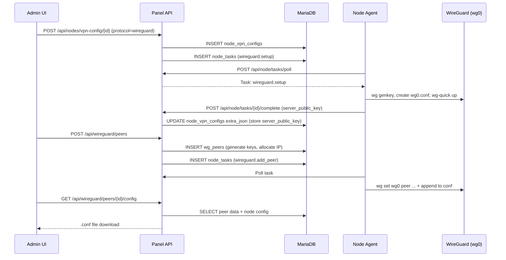

# Design Document: WireGuard Protocol Support

## Overview

This design implements full WireGuard VPN protocol support for KorisPanel, covering server setup, peer lifecycle management, client configuration generation, gaming optimization, customer portal integration, and plan-based auto-provisioning. The implementation extends the existing node agent task system and fits within the 1GB RAM/single-core deployment constraints.

### Key Design Decisions

1. **Leverage existing task dispatch pattern**: WireGuard operations (setup, add_peer, remove_peer, update_config) use the same node_tasks table and poll-based execution model as all other node operations.
2. **Server-side key generation**: The panel generates client key pairs to enable config file downloads without requiring client-side key exchange. Private keys are stored encrypted at rest.
3. **IP allocation via DB queries**: Next-available-IP is computed by querying existing active peers on a node's subnet, avoiding a separate IP pool table.
4. **Gaming optimize as extra_json flag**: Gaming optimization settings are stored in the node_vpn_configs.extra_json field alongside other WireGuard-specific parameters, reusing the existing config structure.
5. **wg syncconf for bulk operations**: The node agent uses `wg syncconf` for bulk peer updates to avoid service restarts, minimizing connection disruption.

## Architecture



### Component Interaction Flow

```mermaid
graph TB
    subgraph Panel Server
        API[API Handlers<br/>wireguard.go]
        WGHelpers[wireguard/<br/>keygen.go, clientconfig.go]
        IPAlloc[IP Allocator<br/>wireguard/ipalloc.go]
    end

    subgraph Database
        VPNConfigs[node_vpn_configs]
        Peers[wg_peers]
        Tasks[node_tasks]
    end

    subgraph Node Agent
        TaskExec[Task Executor<br/>main.go]
        WGCmd[wg CLI]
        WGConf[/etc/wireguard/wg0.conf]
    end

    subgraph Frontend
        AdminWG[Admin WireGuard Panel]
        PortalWG[Portal Config Download]
    end

    API --> WGHelpers
    API --> IPAlloc
    API --> VPNConfigs
    API --> Peers
    API --> Tasks
    TaskExec --> WGCmd
    TaskExec --> WGConf
    AdminWG --> API
    PortalWG --> API
```

## Components and Interfaces

### 1. Panel API Endpoints

#### Admin Endpoints (require admin auth)

| Method | Path | Description |
|--------|------|-------------|
| GET | `/api/wireguard/peers` | List all peers with optional filters |
| POST | `/api/wireguard/peers` | Create a new peer (generates keys, allocates IP) |
| DELETE | `/api/wireguard/peers/{id}` | Revoke a peer |
| GET | `/api/wireguard/peers/{id}/config` | Download peer .conf file |
| POST | `/api/nodes/vpn-config/{nodeId}` | Create/update WireGuard config (existing endpoint, extended for wireguard protocol) |
| GET | `/api/nodes/vpn-config/{nodeId}` | Get node VPN configs including WireGuard |

#### Portal Endpoints (require customer auth)

| Method | Path | Description |
|--------|------|-------------|
| GET | `/api/portal/wireguard/peers` | List customer's WireGuard peers |
| GET | `/api/portal/wireguard/peers/{id}/config` | Download config for customer's own peer |
| GET | `/api/portal/wireguard/peers/{id}/qr` | Get QR code PNG for peer config |

#### Node Agent Endpoints (node token auth)

| Method | Path | Description |
|--------|------|-------------|
| POST | `/api/node/push` | Status push (already includes `wireguard_status` field, extended with peer stats) |
| POST | `/api/node/tasks/poll` | Poll pending tasks (existing) |
| POST | `/api/node/tasks/{id}/complete` | Report task completion (existing) |

### 2. Node Agent Task Handlers

| Task Action | Payload | Behavior |
|-------------|---------|----------|
| `wireguard.setup` | `{port, network, dns_1, dns_2, mtu}` | Generate server keypair, write wg0.conf [Interface], enable+start wg-quick@wg0, return server_public_key |
| `wireguard.add_peer` | `{public_key, preshared_key, allowed_ips}` | `wg set wg0 peer ...` + append [Peer] block to wg0.conf |
| `wireguard.remove_peer` | `{public_key}` | `wg set wg0 peer ... remove` + remove [Peer] block from wg0.conf |
| `wireguard.update_config` | `{port, network, dns_1, dns_2, mtu, gaming_optimize}` | Rewrite [Interface] in wg0.conf, apply gaming rules if enabled, `wg syncconf` |
| `wireguard.sync_config` | `{}` | `wg-quick strip wg0` → `wg syncconf wg0` (existing) |

### 3. IP Allocation Module

New file: `panel/internal/wireguard/ipalloc.go`

```go
package wireguard

// AllocateNextIP finds the next available IP in the given CIDR, excluding
// network address, broadcast (for IPv4), gateway (.1), and any IPs already
// assigned to active peers on this node.
func AllocateNextIP(networkCIDR string, usedIPs []string) (string, error)

// ParseSubnetRange returns the first usable and last usable IP in a CIDR.
func ParseSubnetRange(networkCIDR string) (first, last net.IP, bits int, err error)
```

### 4. Frontend Components

#### Admin UI (`panel/web/admin/`)

- `src/views/nodes/WireGuardConfig.vue` — Per-node WireGuard configuration form (port, CIDR, DNS, MTU, gaming optimize toggle)
- `src/views/wireguard/PeerList.vue` — Paginated peer list with filters (node, status, customer)
- `src/views/wireguard/PeerCreate.vue` — Dialog for creating peers (select node, optionally assign customer)
- `src/composables/useWireGuard.ts` — API composable for WireGuard endpoints

#### Portal UI (`panel/web/portal/`)

- `src/views/WireGuardPeers.vue` — Customer's peer list with download/QR buttons
- `src/composables/useWireGuardPortal.ts` — Portal API composable

### 5. Gaming Optimize Implementation

When `gaming_optimize` is enabled in node_vpn_configs.extra_json:

**Panel-side (config generation):**
- MTU set to 1280 (reduced from default 1420)
- PersistentKeepalive set to 15 (reduced from default 25)

**Node-side (wireguard.update_config task with gaming_optimize=true):**
```bash
# Apply fwmark to WireGuard traffic
wg set wg0 fwmark 51820

# Add ip rule for priority routing
ip rule add fwmark 51820 table 51820 priority 100
ip route add default dev wg0 table 51820

# Set interface MTU
ip link set wg0 mtu 1280
```

**Node-side (gaming_optimize=false / disable):**
```bash
ip rule del fwmark 51820 table 51820 2>/dev/null
ip route del default dev wg0 table 51820 2>/dev/null
ip link set wg0 mtu 1420
```

## Data Models

### Database Schema (existing migration 014_wireguard.sql)

```sql
-- Already applied: node_vpn_configs protocol ENUM extended with 'wireguard'
-- Already applied: wg_peers table

CREATE TABLE IF NOT EXISTS wg_peers (
    id BIGINT AUTO_INCREMENT PRIMARY KEY,
    customer_id BIGINT NULL,
    node_id BIGINT NOT NULL,
    public_key VARCHAR(44) NOT NULL,
    preshared_key VARCHAR(44) NULL,
    private_key_encrypted TEXT NULL,
    allowed_ips VARCHAR(128) NOT NULL,
    endpoint VARCHAR(128) NULL,
    status ENUM('active','disabled','revoked') NOT NULL DEFAULT 'active',
    last_handshake_at DATETIME NULL,
    rx_bytes BIGINT NOT NULL DEFAULT 0,
    tx_bytes BIGINT NOT NULL DEFAULT 0,
    created_at TIMESTAMP DEFAULT CURRENT_TIMESTAMP,
    updated_at TIMESTAMP DEFAULT CURRENT_TIMESTAMP ON UPDATE CURRENT_TIMESTAMP,
    UNIQUE KEY node_pubkey (node_id, public_key),
    INDEX idx_customer (customer_id),
    INDEX idx_node_id (node_id),
    INDEX idx_status (status)
);
```

### node_vpn_configs.extra_json for WireGuard

```json
{
  "server_public_key": "base64...",
  "dns_1": "1.1.1.1",
  "dns_2": "8.8.8.8",
  "mtu": 1420,
  "gaming_optimize": false,
  "network_ipv6": "fd00:wg::/64"
}
```

### Node Agent Status Push Extension

The existing `wireguard_status` field in the push payload already reports service status. Extended payload for peer stats:

```json
{
  "wireguard_status": "running",
  "wireguard_peers": [
    {
      "public_key": "base64...",
      "last_handshake": "2024-01-15T10:30:00Z",
      "rx_bytes": 12345678,
      "tx_bytes": 87654321
    }
  ],
  "wireguard_active_peers": 12
}
```

### Generated Client Config File Format

```ini
[Interface]
PrivateKey = <client_private_key>
Address = 10.66.66.2/32
DNS = 1.1.1.1, 8.8.8.8

[Peer]
PublicKey = <server_public_key>
PresharedKey = <preshared_key>
AllowedIPs = 0.0.0.0/0, ::/0
Endpoint = vpn.example.com:51820
PersistentKeepalive = 25
```

With gaming optimize:
```ini
[Interface]
PrivateKey = <client_private_key>
Address = 10.66.66.2/32
DNS = 1.1.1.1, 8.8.8.8
MTU = 1280

[Peer]
PublicKey = <server_public_key>
PresharedKey = <preshared_key>
AllowedIPs = 0.0.0.0/0, ::/0
Endpoint = vpn.example.com:51820
PersistentKeepalive = 15
```

## Correctness Properties

*A property is a characteristic or behavior that should hold true across all valid executions of a system — essentially, a formal statement about what the system should do. Properties serve as the bridge between human-readable specifications and machine-verifiable correctness guarantees.*

### Property 1: Port validation accepts only valid ranges

*For any* integer value, the WireGuard port validation SHALL accept the value if and only if it is between 1024 and 65535 inclusive.

**Validates: Requirements 1.6**

### Property 2: CIDR validation accepts valid IPv4 and IPv6 subnets

*For any* string input, the network CIDR validation SHALL accept the input if and only if `net.ParseCIDR` succeeds and the result is a valid IPv4 or IPv6 subnet.

**Validates: Requirements 1.7, 11.1, 11.4**

### Property 3: Generated keys are valid WireGuard keys

*For any* invocation of GenerateKeyPair or GeneratePresharedKey, the resulting key SHALL be a 44-character base64 string that decodes to exactly 32 bytes.

**Validates: Requirements 3.1**

### Property 4: IP allocation returns addresses within subnet that don't conflict

*For any* valid network CIDR and set of already-used IPs, AllocateNextIP SHALL return an IP that is (a) within the subnet, (b) not the network address, broadcast address, or gateway (.1), and (c) not in the set of used IPs.

**Validates: Requirements 3.2, 3.5**

### Property 5: Config file generation round-trip

*For any* valid ClientConfig (with non-empty PrivateKey, Address, DNS, ServerPublicKey, PresharedKey, Endpoint), generating the config file then parsing it as INI SHALL produce sections and key-value pairs that exactly match the input values.

**Validates: Requirements 6.1, 6.3, 6.5**

### Property 6: Peer revocation makes IP available for reallocation

*For any* active peer that is revoked, the peer's assigned IP SHALL not appear in the set of "used IPs" returned by the allocation query (status='active' filter), making it available for new allocations.

**Validates: Requirements 4.1, 4.4**

### Property 7: removePeerFromConfig preserves other peers

*For any* valid WireGuard config file containing N peer blocks, removing a specific peer by public key SHALL result in a config with exactly N-1 peer blocks, where the removed peer's block is absent and all other peer blocks are preserved with their original content.

**Validates: Requirements 4.3**

### Property 8: Customer portal peer isolation

*For any* customer, querying the portal WireGuard peers endpoint SHALL return exactly the peers where customer_id matches the authenticated customer, and no peers belonging to other customers.

**Validates: Requirements 8.1, 8.3**

### Property 9: Gaming optimize config transformation

*For any* WireGuard node configuration, enabling gaming_optimize SHALL produce a client config with MTU=1280 and PersistentKeepalive=15, while disabling it SHALL produce MTU=1420 (or omitted) and PersistentKeepalive=25.

**Validates: Requirements 7.2, 7.3, 7.6**

### Property 10: WireGuard status active peer count

*For any* set of peer handshake timestamps, the active peer count SHALL equal the number of peers whose last handshake is within 3 minutes of the current time.

**Validates: Requirements 5.3, 10.2**

## Error Handling

| Scenario | Response | Recovery |
|----------|----------|----------|
| Invalid port (outside 1024-65535) | 400 Bad Request `{"error": "invalid_port"}` | Client corrects input |
| Invalid CIDR | 400 Bad Request `{"error": "invalid_network_cidr"}` | Client corrects input |
| IP pool exhausted | 400 Bad Request `{"error": "ip_pool_exhausted"}` | Admin expands subnet or removes revoked peers |
| Private key not available for config | 400 Bad Request `{"error": "private_key_not_available"}` | Admin regenerates peer |
| Node has no WireGuard config | 400 Bad Request `{"error": "wireguard_config_not_found_for_node"}` | Admin enables WireGuard on node first |
| Node task execution failure | Task status "failed" with error text | Admin reviews error, retries or fixes node |
| Customer downloads other's config | 403 Forbidden `{"error": "forbidden"}` | N/A (authorization enforcement) |
| WireGuard key validation failure | 400 Bad Request `{"error": "invalid key format"}` | Client provides valid 44-char base64 key |
| Node agent wg command failure | Task "failed" with command output | Admin checks WireGuard installation on node |
| Duplicate public key on same node | 409 Conflict (DB unique constraint) | Should not happen with generated keys; admin intervention |

## Testing Strategy

### Property-Based Tests (fast-check)

Property-based testing is appropriate for this feature because it contains pure functions with clear input/output behavior (key generation, IP allocation, config generation/parsing, config file manipulation, validation functions).

**Library:** fast-check (already in project for frontend PBT), Go `testing/quick` or `pgregory.net/rapid` for backend

**Configuration:** Minimum 100 iterations per property test.

**Tag format:** `Feature: wireguard-protocol, Property {N}: {description}`

| Property | Test Location | What Varies |
|----------|---------------|-------------|
| P1: Port validation | `panel/internal/wireguard/validation_test.go` | Random integers across full int range |
| P2: CIDR validation | `panel/internal/wireguard/validation_test.go` | Random strings, valid/invalid CIDRs, IPv4/IPv6 |
| P3: Key generation | `panel/internal/wireguard/keygen_test.go` | Multiple key generation runs |
| P4: IP allocation | `panel/internal/wireguard/ipalloc_test.go` | Random subnets (/24, /16), random used-IP sets |
| P5: Config round-trip | `panel/internal/wireguard/clientconfig_test.go` | Random valid ClientConfig structs |
| P6: Revocation frees IP | `panel/internal/wireguard/ipalloc_test.go` | Random peer sets with revocations |
| P7: removePeerFromConfig | `node/cmd/node/wireguard_test.go` | Random multi-peer config files |
| P8: Portal peer isolation | `panel/web/shared/src/__tests__/wireguard.test.ts` | Random multi-customer peer sets |
| P9: Gaming optimize | `panel/internal/wireguard/clientconfig_test.go` | Config with/without gaming flag |
| P10: Active peer count | `node/cmd/node/wireguard_test.go` | Random peer lists with various handshake times |

### Unit Tests (example-based)

- Config generation with dual-stack addresses
- Default values applied when no custom config
- HTTP response headers for .conf download
- Admin UI component rendering (form fields, table columns)
- QR code generation from config string
- Enable/disable WireGuard without removing peers

### Integration Tests

- Full task lifecycle: dispatch → poll → execute → complete
- Node agent `wg` command execution with mock filesystem
- Gaming optimize ip rule/iptables command execution
- Plan auto-provisioning on subscription activation
- Subscription termination revokes peer

### Smoke Tests

- Migration 014_wireguard.sql applies cleanly
- wg_peers table has correct schema and indexes
- Protocol ENUM accepts "wireguard"
- 50 peers can be created without resource issues
